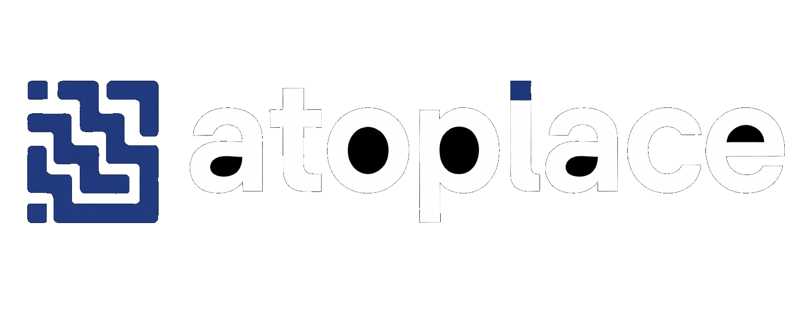
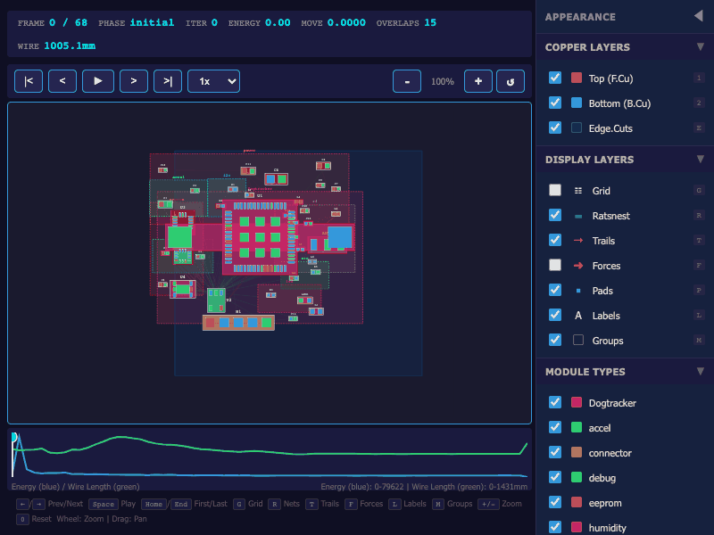
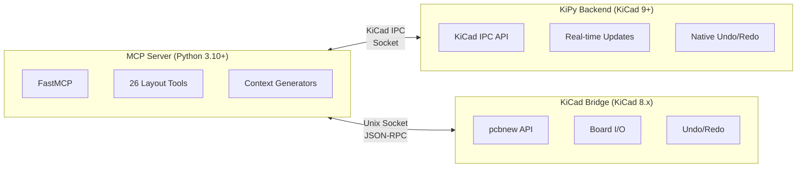

<p align="center">
  <a href="#"></a>
</p>

---

<p align="center">
  
  
  
  
  
</p>

<p align="center">
  <strong>The AI Pair Designer for Professional PCB Layout</strong>
</p>

**atoplace** is an intelligent orchestration layer for PCB design that bridges the gap between schematic and physical layout. It automates the tedious 80% of design—placement optimization and DFM validation—while strictly adhering to "Manhattan" aesthetics and Signal Integrity (SI) best practices.

Designed to work seamlessly with **[atopile](https://atopile.io)** and **[KiCad](https://kicad.org)**.

<p align="center">
  
</p>

## 🚀 Why atoplace?

PCB layout automation has historically been "black box" and "messy"—producing organic, unreadable layouts that professional engineers reject. atoplace takes a different approach:

*   **Human-Grade Aesthetics**: We don't just minimize wirelength. We enforce **grids**, **alignment**, and **orthogonal routing** so the result looks like *you* designed it.
*   **Physics-First**: We model high-degree nets (GND/VCC) correctly to prevent component collapse, and prioritize critical signals (USB, RF) before general routing.
*   **Transparent & Interactive**: No lock-in. The source of truth is always your `.kicad_pcb` file. You can take over manually at any second.

## ✨ Key Features

- **🧩 Manhattan Legalizer**: Transforms "organic" force-directed placements into professional, grid-snapped, and row-aligned layouts using PCA axis detection and Abacus-style overlap resolution.
- **🧠 Intelligent Placement**: Force-directed annealing engine with a **Star Model** for stable high-degree net (GND/VCC) handling and adaptive damping for oscillation control.
- **🚀 A* Routing**: High-performance, deterministic geometric router using a **Greedy Multiplier** ($w=2-3$) and **Spatial Hash Indexing** for O(~1) collision detection.
- **🔍 Confidence Scoring**: Automated assessment of your board's routability, signal integrity risks, and DFM compliance.
- **💬 Natural Language Control**: "Move the USB connector to the left edge", "Align these capacitors", "Keep the crystal near the MCU".
- **🔌 Atopile Native**: First-class support for `atopile` projects with `ato-lock.yaml` parsing and module-aware grouping.

## 🛠️ Installation

```bash
pip install atoplace
```

### Requirements
- **Python 3.10+**
- **KiCad 8.0+** (atoplace uses the `pcbnew` Python API)

> **Pro Tip:** atoplace works best when run using the Python interpreter bundled with KiCad:

**macOS:**
```bash
/Applications/KiCad/KiCad.app/Contents/Frameworks/Python.framework/Versions/Current/bin/python3 -m pip install atoplace
```

**Windows:**
```powershell
"C:\Program Files\KiCad\8.0\bin\python.exe" -m pip install atoplace
```

## ⚡ Quick Start

### 1. Optimize Placement
Automatically place components with "Manhattan" legalization:
```bash
atoplace place board.kicad_pcb --grid 0.5 --constraints "USB on left edge"
```

### 2. Route the Board
Route all nets using the internal A* geometric planner:
```bash
atoplace route board.kicad_pcb --visualize
```

### 3. Validate Layout
Check your board against DFM rules (JLCPCB, OSH Park, etc.):
```bash
atoplace validate board.kicad_pcb --dfm jlcpcb_standard
```

### 4. Interactive Mode
Refine your design using natural language:
```bash
atoplace interactive board.kicad_pcb
# > "Rotate U1 45 degrees"
# > "Move C1 closer to U1"
# > "Save"
```

### 5. MCP Server (LLM Integration)
Expose atoplace tools to AI agents via the Model Context Protocol:
```bash
atoplace mcp --launch
```

See [MCP Server](#-mcp-server) section below for details.

## 🗺️ Roadmap

- **Milestone A (Q1 2026): Solid Foundation** ✅
  - [x] Manhattan Legalizer (Grid snapping & PCA Alignment).
  - [x] Physics Engine scaling (Star Model & Adaptive Damping).
  - [x] Atopile `ato-lock.yaml` and module hierarchy integration.
- **Milestone B (Q1-Q2 2026): Routing & Persistence** 🚧
  - [x] **A* Geometric Planner** (Greedy Multiplier & Spatial Indexing).
  - [x] **MCP Server** with IPC bridge for LLM agent integration.
  - [x] **Live KiCad IPC** via kipy for real-time component manipulation (KiCad 9+).
  - [ ] `atoplace.lock` Sidecar Persistence for Atopile.
  - [ ] BGA/QFN Fanout Generator.
  - [ ] Differential Pair Path Planning.
- **Milestone C (Q2 2026): Professional Agent** 🔮
  - [ ] Deep Signal Integrity Analysis (Crosstalk/Impedance).
  - [ ] Automated Manufacturing Outputs (Gerbers/BOM/PNP).
  - [ ] Multi-board design support.

## 📂 Architecture

```
atoplace/
├── board/          # Board abstraction & KiCad/Atopile adapters
├── placement/      # Force-directed physics & Manhattan Legalizer
│   ├── force_directed.py   # Physics Engine (Star Model)
│   ├── legalizer.py        # Manhattan Pipeline (REQ-P-03)
│   └── module_detector.py  # Hierarchy Analysis
├── routing/        # A* Geometric Router
│   ├── astar_router.py     # Core A* with Greedy Multiplier
│   ├── spatial_index.py    # O(~1) collision detection
│   └── obstacle_map.py     # Obstacle generation
├── nlp/            # Natural Language & Intent Engine
├── validation/     # Confidence Scorer & DFM/DRC Checker
├── mcp/            # MCP Server for LLM Integration
│   ├── server.py           # FastMCP server with 26 tools
│   ├── backends.py         # Backend mode detection & factory
│   ├── kipy_session.py     # Live KiCad IPC session (KiCad 9+)
│   ├── kipy_adapter.py     # kipy ↔ atoplace data conversion
│   ├── bridge.py           # KiCad bridge (Python 3.9)
│   ├── ipc.py              # IPC protocol & serialization
│   ├── launcher.py         # Process manager
│   └── context/            # Context generators (macro/micro/vision)
└── cli.py          # CLI entry point
```

## 🤖 MCP Server

atoplace includes a **Model Context Protocol (MCP)** server that exposes 26 PCB design tools to LLM agents like Claude. This enables conversational PCB layout design.

### Quick Start

Just run:
```bash
python -m atoplace.mcp.launcher
```

That's it! The launcher:
- **Auto-detects** KiCad Python on macOS, Linux, and Windows
- **Starts** the KiCad bridge (for pcbnew access)
- **Starts** the MCP server (exposes tools to LLM)
- **Manages** lifecycle and clean shutdown

### Claude Code / Claude Desktop Configuration

Add to your MCP config:

```json
{
  "mcpServers": {
    "atoplace": {
      "command": "python",
      "args": ["-m", "atoplace.mcp.launcher"]
    }
  }
}
```

> **Note**: Replace `python` with the path to your atoplace virtualenv Python if needed.

### 🔴 Live KiCad IPC Mode (KiCad 9+)

**New!** With KiCad 9+, atoplace can manipulate components in real-time without save/reload cycles. Changes appear instantly in your KiCad viewport!

**Requirements:**
- KiCad 9.0 or later (with IPC API enabled)
- `kicad-python` package: `pip install kicad-python`

**Setup:**
```bash
# Install the kipy optional dependency
pip install atoplace[kipy]

# Or install directly
pip install kicad-python
```

**Usage:**
1. Open your `.kicad_pcb` in KiCad 9+ PCB Editor
2. Start the MCP server with the kipy backend:
   ```bash
   ATOPLACE_BACKEND=kipy python -m atoplace.mcp.launcher
   ```
3. Components move instantly as you interact with the LLM!

**How it works:** The kipy backend connects directly to KiCad's IPC socket and uses the official API to update component positions in real-time. Native undo/redo (Cmd/Ctrl+Z) works seamlessly.

### Architecture



**Backend Modes:**
| Mode | KiCad Version | Real-time | How it works |
|------|--------------|-----------|--------------|
| `kipy` | 9.0+ | ✅ Yes | Direct IPC API connection |
| `ipc` | 8.0+ | ❌ No | File-based bridge process |
| `direct` | 8.0+ | ❌ No | Direct file manipulation |

### Available Tools (26 total)

| Category | Tools |
|----------|-------|
| **Board Management** | `load_board`, `save_board`, `undo`, `redo` |
| **Placement Actions** | `move_component`, `place_next_to`, `align_components`, `distribute_evenly`, `stack_components`, `swap_positions`, `arrange_pattern`, `cluster_around`, `group_components`, `lock_components` |
| **Discovery** | `find_components`, `get_board_bounds`, `get_unplaced_components` |
| **Topology** | `get_connected_components`, `get_critical_nets` |
| **Context** | `inspect_region`, `get_board_summary`, `get_semantic_grid`, `get_module_map`, `render_region` |
| **Validation** | `check_overlaps`, `validate_placement` |

### Environment Variables (Optional)

| Variable | Description | Default |
|----------|-------------|---------|
| `ATOPLACE_BACKEND` | Backend mode: `kipy`, `ipc`, or `direct` | Auto-detected |
| `ATOPLACE_USE_KIPY` | Enable kipy mode (`1` or `true`) | `false` |
| `KICAD_PYTHON` | Override KiCad Python path | Auto-detected |
| `ATOPLACE_LOG` | Log file location | `/tmp/atoplace.log` |

### Example LLM Conversation

```
User: Load the board at examples/dogtracker/layouts/default/default.kicad_pcb

Claude: [Calls load_board tool]
Board loaded successfully:
- 37 components
- 72 nets

User: Find all the capacitors and align them horizontally

Claude: [Calls find_components with query="C", filter_by="ref"]
Found 12 capacitors: C1, C2, C3...

[Calls align_components with refs=["C1","C2",...], axis="y"]
Aligned 12 capacitors along the Y axis.

User: Check if there are any overlaps

Claude: [Calls check_overlaps]
No overlapping components detected. The placement is valid.

User: Save the board

Claude: [Calls save_board]
Board saved to: examples/dogtracker/layouts/default/default.placed.kicad_pcb
```

## 📄 License

MIT License - see [LICENSE](LICENSE) for details.

## 🙏 Acknowledgments

*   **[atopile](https://github.com/atopile/atopile)**: The declarative language that makes code-driven hardware possible.
*   **[KiCad](https://kicad.org)**: The open-source EDA standard we build upon.
*   **[kicad-python](https://github.com/kicad/kicad-python)**: Official Python bindings for KiCad's IPC API.
*   **[Freerouting](https://github.com/freerouting/freerouting)**: The open-source autorouting engine.
