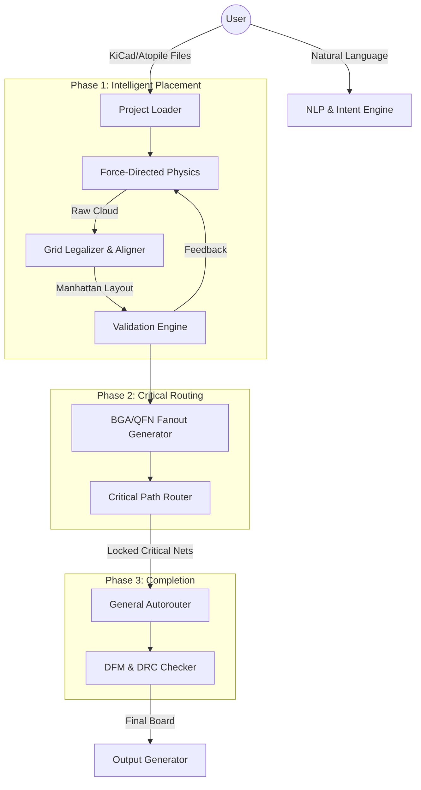

# Product Requirements Document: AtoPlace (v2.0)

**Date:** 2026-01-11
**Status:** Living Document
**Target Audience:** Development Team, Product Stakeholders

---

## Index

- 1. Product Vision
- 2. Core Value Pillars
- 3. System Architecture
- 4. Functional Requirements
- 5. Roadmap & Phasing
- 6. Technical Constraints & Standards
- Appendix A: Atopile Integration (Future Spec)
- Appendix B: MCP Server Integration (Future Spec)
- Appendix C: Freerouting Integration (Future Spec)

---

## 1. Product Vision
To provide Professional Electrical Engineers with an "AI Pair Designer" that automates the tedious 80% of PCB layout (placement optimization, non-critical routing, validation) while strictly adhering to "Manhattan" design aesthetics, DFM constraints, and Signal Integrity (SI) best practices. Unlike "Black Box" autorouters, AtoPlace produces human-readable, professional-grade layouts that an engineer would be proud to claim as their own.

---

## 2. Core Value Pillars

### 2.1. "Human-Grade" Aesthetics (The "Turing Test" of Layout)
*   **Grid Compliance:** Components must not float; they must snap to user-defined grids (e.g., 0.1mm, 0.5mm, 1mm).
*   **Alignment:** Components, especially passives (R/C/L), must form strict rows or columns.
*   **Manhattan Routing:** Traces must follow 45/90-degree routing rules. No "any-angle" spaghetti unless specifically requested (e.g., flex PCBs).

### 2.2. Physics-Driven Signal Integrity
*   **Impedance First:** Critical nets (USB, Ethernet, RF) are prioritized and routed with impedance/length matching constraints.
*   **Power Plane Integrity:** Component placement prioritizes continuous ground return paths.
*   **Hierarchy-Aware:** Placement respects the logical signal flow (Input → Processing → Output).

### 2.3. Transparent Interactivity
*   **No Lock-in:** Native KiCad files are the source of truth. The user can take over manually at any moment.
*   **Explainable Actions:** The system can explain *why* a component was placed in a specific location (e.g., "Placed C1 near U1 to minimize loop inductance").
*   **Natural Language Control:** Users can direct high-level moves ("Move the USB connector to the bottom edge") without dragging individual pads.

---

## 3. System Architecture

AtoPlace operates as an orchestration layer over existing, proven EDA tools (KiCad, Freerouting).



---

## 4. Functional Requirements

### 4.1. Placement Engine (The "Brain")
*   **REQ-P-01 (Clustering):** System MUST group components by logical module (Power, Analog, Digital, RF) using schema hierarchy or netlist topology.
*   **REQ-P-02 (Physics):** System MUST use force-directed annealing for global optimization ($O(N)$ Star Model for large nets).
*   **REQ-P-03 (Legalization - CRITICAL):** System MUST apply a post-physics "Legalization Pass" that:
    *   Snaps component centroids to the user grid.
    *   Aligns adjacent same-size components (e.g., 0402 resistors) into shared-axis rows/columns.
    *   Removes overlaps using AABB/SAT collision detection.
*   **REQ-P-04 (Flow):** System MUST attempt to place components in logical signal flow order (e.g., Connector → ESD → PHY → MCU).

### 4.2. Routing Engine (The "Nervous System")
*   **REQ-R-01 (Fanout):** System MUST generate escape patterns (dogbone, via-in-pad) for high-density components (BGA/QFN) *before* general routing.
*   **REQ-R-02 (Criticality):** System MUST support a "Priority Queue" for nets:
    *   *Tier 1:* Diff-pairs, RF, Clocks (Route first, lock).
    *   *Tier 2:* Power/Ground (Route second, huge widths/planes).
    *   *Tier 3:* General Signals (GPIO, LED).
*   **REQ-R-03 (Completion):** System uses `Freerouting` (or similar) ONLY for Tier 3 nets, ensuring Tier 1/2 are protected.

### 4.3. Validation & Physics Feedback
*   **REQ-V-01 (Proactive Forces):** Validation rules (e.g., "Decoupling caps < 2mm") MUST be projected into the physics engine as high-strength attractive forces.
*   **REQ-V-02 (Confidence):** System MUST emit a "Confidence Score" (0-100%) based on:
    *   Routability estimation (congestion maps).
    *   Signal Integrity metrics (estimated crosstalk, return path discontinuities).
    *   DFM compliance (clearances, acid traps).

### 4.4. Integration & UX
*   **REQ-I-01 (Atopile):** System MUST support `ato-lock.yaml` as a first-class citizen for persistent placement data.
*   **REQ-I-02 (CLI):** System MUST provide a CLI for CI/CD integration (`atoplace check board.kicad_pcb`).
*   **REQ-I-03 (MCP):** System MUST expose an MCP Server interface for LLM agents (Claude, etc.) to perform "Human-in-the-loop" design.

---

## 5. Roadmap & Phasing

### Phase 1: The "Solid Foundation" (Current Focus)
*   **Goal:** A tool that places components logically and legally, even if not yet routed.
*   **Key Deliverables:**
    *   Fix Physics Engine (Star model, AABB collision).
    *   Implement "Legalizer" (Grid snapping, row alignment).
    *   Fix Atopile mapping (Instance path resolution).

### Phase 2: The "Routing Assistant"
*   **Goal:** A tool that can safely route a board without ruining signal integrity.
*   **Key Deliverables:**
    *   Fanout Generator for QFN/BGA.
    *   Critical Net Classifier (detect USB, Power, etc.).
    *   Partial Routing Workflow (Route critical -> Lock -> Autoroute rest).

### Phase 3: The "Professional Agent"
*   **Goal:** An autonomous agent capable of passing a Senior Engineer's design review.
*   **Key Deliverables:**
    *   MCP Server for full conversational design.
    *   Deep Signal Integrity checks (Impedance calculator, Crosstalk estimator).
    *   Automated DFM output generation (Gerbers, BOM, Pick-and-Place).

---

## Appendix A: Atopile Integration (Future Spec)

### Overview

[atopile](https://atopile.io/) is a declarative language for electronics design that compiles `.ato` source files directly to KiCad board files. AtoPlace integrates with atopile to provide intelligent placement optimization within the atopile build workflow.

### Integration Architecture

```
┌─────────────────────────────────────────────────────────────────┐
│                    ATOPILE BUILD PIPELINE                       │
│                                                                 │
│  .ato files  ──►  ato build  ──►  .kicad_pcb (unplaced)        │
│                       │                                         │
│                       ▼                                         │
│              ┌─────────────────┐                               │
│              │    AtoPlace     │                               │
│              │  Placement Hook │                               │
│              └────────┬────────┘                               │
│                       │                                         │
│                       ▼                                         │
│              .kicad_pcb (optimized placement)                   │
│                       │                                         │
│                       ▼                                         │
│              Continue build (routing, outputs)                  │
└─────────────────────────────────────────────────────────────────┘
```

### Integration Approach: Post-Build File Processing

Rather than embedding into atopile's compiler, AtoPlace operates on atopile's output files:

**Rationale:**
1. **Decoupled development** - No dependency on atopile internal APIs
2. **Version resilience** - Works with any atopile version that produces KiCad files
3. **Standalone operation** - Same tool works for pure KiCad projects
4. **Simpler maintenance** - Single adapter (KiCad) instead of two

**Data Sources:**
| Data | Source File | Purpose |
|------|-------------|---------|
| Components | `.kicad_pcb` | Footprints, pads, initial positions |
| Netlist | `.kicad_pcb` | Connectivity (nets already embedded) |
| Board outline | `.kicad_pcb` | Boundary constraints |
| Component values | `ato-lock.yaml` | Selected parts for module detection |
| Hierarchy | `.ato` files (optional) | Module grouping hints |

### Workflow Integration

#### Option A: CLI Integration (MVP)
```bash
# Standard atopile build
ato build

# Run AtoPlace on the generated board
atoplace place elec/layout/default/project.kicad_pcb \
  --constraints "USB connector on left edge" \
  --dfm jlcpcb

# Continue with manual routing or Freerouting
```

#### Option B: Build Hook (Future)
Configure in `ato.yaml`:
```yaml
builds:
  default:
    entry: elec/src/project.ato:MainModule
    hooks:
      post-netlist: atoplace place --auto
```

#### Option C: MCP Server Integration (Future)
Claude interacts with both atopile and AtoPlace:
```
User: "Build my ESP32 board and optimize the placement"
Claude: [calls ato build] -> [calls atoplace place] -> [returns confidence report]
```

### Atopile-Specific Features

#### Module Detection Enhancement
Atopile's hierarchical structure provides explicit module boundaries:

```python
# From .ato file structure, infer:
# - power_supply module -> group power components
# - sensor_interface module -> group sensor components
# - mcu_core module -> central MCU placement
```

**Implementation:**
```python
class AtopileModuleParser:
    """Parse .ato files to extract module hierarchy for grouping."""

    def parse_hierarchy(self, ato_file: Path) -> Dict[str, List[str]]:
        """Extract module->component mappings from .ato source."""
        # Parse module definitions
        # Map component instances to their parent modules
        # Return hierarchy for GroupingConstraint generation
```

#### Component Value Extraction
The `ato-lock.yaml` contains selected component values:

```yaml
# Example ato-lock.yaml structure
components:
  C1:
    mpn: "GRM155R71C104KA88D"
    value: "100nF"
    package: "0402"
  U1:
    mpn: "ESP32-S3-WROOM-1"
    package: "QFN-56"
```

**Use for:**
- Decoupling capacitor identification (for proximity to ICs)
- Power component detection (inductors, bulk caps)
- Footprint size awareness for spacing

#### Constraint Inference from Atopile
Certain atopile patterns imply placement constraints:

| Atopile Pattern | Inferred Constraint |
|-----------------|---------------------|
| `decoupling_cap ~ ic.vdd` | ProximityConstraint(cap, ic) |
| `crystal ~ mcu.xtal` | ProximityConstraint(crystal, mcu) + short trace |
| `usb_connector.dp ~ esd.io` | ProximityConstraint(esd, connector) |
| `power_input -> DCDCConverter` | Edge placement preference |

### File Handling

#### Input Processing
```python
class AtopileProjectLoader:
    """Load an atopile project for placement optimization."""

    def __init__(self, project_root: Path):
        self.root = project_root
        self.ato_yaml = self._load_ato_yaml()
        self.lock_file = self._load_lock_file()

    def get_board_path(self, build_name: str = "default") -> Path:
        """Get path to generated KiCad board file."""
        entry = self.ato_yaml["builds"][build_name]["entry"]
        # elec/src/project.ato:Module -> elec/layout/default/project.kicad_pcb
        return self._entry_to_board_path(entry)

    def load_board(self, build_name: str = "default") -> Board:
        """Load board through KiCad adapter."""
        board_path = self.get_board_path(build_name)
        board = Board.from_kicad(board_path)

        # Enhance with atopile metadata
        self._apply_module_hierarchy(board)
        self._apply_component_values(board)

        return board
```

#### Output Handling
Placement results write back to the same `.kicad_pcb` file:

```python
def save_placement(self, board: Board, build_name: str = "default"):
    """Save optimized placement back to KiCad file."""
    board_path = self.get_board_path(build_name)
    board.to_kicad(board_path)

    # Optionally update ato-lock.yaml with placement positions
    # (if atopile supports position persistence)
```

### CLI Extensions for Atopile

```bash
# Auto-detect atopile project
atoplace place .  # Detects ato.yaml, finds board

# Specify build target
atoplace place . --build my-variant

# Use atopile hierarchy for grouping
atoplace place . --use-ato-modules

# Full atopile workflow
atoplace ato-workflow . \
  --constraints "power on bottom edge" \
  --dfm jlcpcb \
  --route  # Also run Freerouting
```

### Implementation Plan

#### Phase 2A: Basic Atopile Support
1. **AtopileProjectLoader** - Detect and parse `ato.yaml`
2. **Board path resolution** - Find `.kicad_pcb` from entry point
3. **CLI integration** - `atoplace place <ato-project-dir>`

#### Phase 2B: Enhanced Metadata
1. **Lock file parser** - Extract component values from `ato-lock.yaml`
2. **Module hierarchy parser** - Parse `.ato` files for grouping
3. **Constraint inference** - Auto-generate constraints from patterns

#### Phase 2C: Workflow Integration
1. **Build hook support** - Post-build placement trigger
2. **Position persistence** - Write positions to lock file (if supported)
3. **MCP integration** - Combined atopile+AtoPlace operations

### Testing Strategy

```python
# tests/test_atopile_integration.py

def test_project_detection():
    """Verify ato.yaml detection and parsing."""

def test_board_path_resolution():
    """Verify correct .kicad_pcb path from entry point."""

def test_module_hierarchy_extraction():
    """Verify .ato parsing for module grouping."""

def test_lock_file_parsing():
    """Verify component value extraction."""

def test_constraint_inference():
    """Verify auto-constraints from atopile patterns."""
```

### Example: ESP32 Sensor Board

```
# Project structure
my-sensor/
├── ato.yaml
├── ato-lock.yaml
├── elec/
│   ├── src/
│   │   ├── sensor.ato      # Main module
│   │   └── parts/
│   └── layout/
│       └── default/
│           └── sensor.kicad_pcb
```

```bash
# Workflow
cd my-sensor
ato build                    # Generate initial board
atoplace place . \
  --constraints "USB-C on left, sensors on top" \
  --use-ato-modules \
  --dfm jlcpcb
# Opens interactive session or applies and saves
```

---

## Appendix B: MCP Server Integration (Future Spec)

### Overview

The [Model Context Protocol (MCP)](https://modelcontextprotocol.io/) enables Claude and other LLMs to interact with AtoPlace through a standardized interface. This allows conversational PCB design workflows where users describe their intent in natural language and Claude orchestrates placement and routing operations.

### Architecture

```
┌─────────────────────────────────────────────────────────────────┐
│                         CLAUDE DESKTOP                          │
│                    or other MCP-compatible client               │
└─────────────────────────────────────────────────────────────────┘
                              │
                         MCP Protocol
                         (JSON-RPC over stdio)
                              │
┌─────────────────────────────────────────────────────────────────┐
│                     ATOPLACE MCP SERVER                         │
│                                                                 │
│  ┌─────────────┐  ┌─────────────┐  ┌─────────────────────────┐ │
│  │   TOOLS     │  │  RESOURCES  │  │       PROMPTS           │ │
│  │             │  │             │  │                         │ │
│  │ place_board │  │ board://    │  │ placement_workflow      │ │
│  │ add_const   │  │ confidence  │  │ constraint_guide        │ │
│  │ validate    │  │ dfm_rules   │  │ troubleshoot_drc        │ │
│  │ route       │  │ components  │  │                         │ │
│  │ export      │  │             │  │                         │ │
│  └─────────────┘  └─────────────┘  └─────────────────────────┘ │
│                              │                                  │
│                    ┌─────────────────┐                         │
│                    │  ATOPLACE CORE  │                         │
│                    │  (Python API)   │                         │
│                    └─────────────────┘                         │
└─────────────────────────────────────────────────────────────────┘
```

### MCP Tools

Tools are functions Claude can invoke to perform actions:

```python
from mcp.server.fastmcp import FastMCP
from atoplace.board import Board
from atoplace.placement import ForceDirectedRefiner
from atoplace.validation import ConfidenceScorer

mcp = FastMCP("AtoPlace PCB Layout Server")

@mcp.tool()
def place_board(
    board_path: str,
    constraints: list[str] | None = None,
    dfm_profile: str = "jlcpcb"
) -> dict:
    """
    Run intelligent placement optimization on a KiCad board.

    Args:
        board_path: Path to .kicad_pcb file or atopile project directory
        constraints: Natural language constraints (e.g., "USB on left edge")
        dfm_profile: Manufacturing profile (jlcpcb, oshpark, pcbway)

    Returns:
        Placement result with confidence score and any flags
    """
    board = Board.from_kicad(board_path)
    # Parse and apply constraints
    # Run force-directed refinement
    # Return results with confidence report
    ...

@mcp.tool()
def add_constraint(
    board_path: str,
    constraint: str
) -> dict:
    """
    Add a placement constraint in natural language.

    Args:
        board_path: Path to the board file
        constraint: Natural language constraint (e.g., "keep C1 close to U1")

    Returns:
        Parsed constraint details and validation status
    """
    ...

@mcp.tool()
def validate_placement(board_path: str) -> dict:
    """
    Run DRC and confidence scoring on current placement.

    Returns:
        Detailed validation report with flags and suggestions
    """
    ...

@mcp.tool()
def route_board(
    board_path: str,
    max_passes: int = 20,
    ignore_nets: list[str] | None = None
) -> dict:
    """
    Run autorouting using Freerouting.

    Args:
        board_path: Path to the board file
        max_passes: Maximum optimization passes
        ignore_nets: Net classes to skip (e.g., ["GND", "VCC"])

    Returns:
        Routing result with completion percentage and any unrouted nets
    """
    ...

@mcp.tool()
def modify_placement(
    board_path: str,
    modification: str
) -> dict:
    """
    Apply a placement modification in natural language.

    Args:
        board_path: Path to the board file
        modification: Natural language command (e.g., "rotate J1 90 degrees")

    Returns:
        Modification result with before/after positions
    """
    ...

@mcp.tool()
def export_manufacturing(
    board_path: str,
    output_dir: str,
    fab: str = "jlcpcb"
) -> dict:
    """
    Generate manufacturing outputs (Gerbers, drill, BOM, PnP).

    Returns:
        List of generated files and any warnings
    """
    ...
```

### MCP Resources

Resources expose data that Claude can read:

```python
@mcp.resource("board://{board_path}/components")
def get_components(board_path: str) -> str:
    """List all components with positions and footprints."""
    board = Board.from_kicad(board_path)
    return format_component_list(board.components)

@mcp.resource("board://{board_path}/nets")
def get_nets(board_path: str) -> str:
    """List all nets with connected components."""
    board = Board.from_kicad(board_path)
    return format_net_list(board.nets)

@mcp.resource("board://{board_path}/confidence")
def get_confidence_report(board_path: str) -> str:
    """Get the current confidence assessment."""
    board = Board.from_kicad(board_path)
    scorer = ConfidenceScorer()
    report = scorer.assess(board)
    return format_confidence_report(report)

@mcp.resource("dfm://{profile}")
def get_dfm_rules(profile: str) -> str:
    """Get DFM rules for a specific fab profile."""
    return format_dfm_profile(get_profile(profile))

@mcp.resource("constraints://examples")
def get_constraint_examples() -> str:
    """Get examples of supported constraint patterns."""
    return CONSTRAINT_EXAMPLES
```

### MCP Prompts

Prompts provide reusable conversation templates:

```python
@mcp.prompt()
def placement_workflow() -> str:
    """Guide for complete placement workflow."""
    return """
    # PCB Placement Workflow

    1. **Load Board**: Use place_board tool with the board path
    2. **Review Components**: Check board://path/components resource
    3. **Add Constraints**: Use add_constraint for placement requirements
    4. **Run Placement**: Execute place_board with constraints
    5. **Validate**: Check confidence report and DRC results
    6. **Iterate**: Use modify_placement for adjustments
    7. **Route**: Run route_board when placement is finalized
    8. **Export**: Generate manufacturing files with export_manufacturing
    """

@mcp.prompt()
def constraint_guide() -> str:
    """Guide for writing placement constraints."""
    return """
    # Constraint Examples

    ## Proximity
    - "Keep C1 close to U1"
    - "Place decoupling caps within 3mm of MCU"

    ## Edge Placement
    - "USB connector on left edge"
    - "Power jack on bottom edge, centered"

    ## Grouping
    - "Group all bypass capacitors together"
    - "Keep analog section separate from digital"

    ## Rotation
    - "Rotate J1 90 degrees clockwise"
    - "Flip U2 to bottom layer"

    ## Fixed Position
    - "Fix LED1 at coordinates (25, 10)"
    - "Lock mounting holes in corners"
    """
```

### Server Implementation

```python
# atoplace/mcp/server.py

from mcp.server.fastmcp import FastMCP
from pathlib import Path
import json

from atoplace.board import Board
from atoplace.board.atopile_adapter import AtopileProjectLoader
from atoplace.placement import ForceDirectedRefiner, ConstraintSolver
from atoplace.validation import ConfidenceScorer, PreRouteValidator
from atoplace.routing import FreeroutingRunner
from atoplace.nlp import ConstraintParser, ModificationHandler
from atoplace.dfm import get_profile

mcp = FastMCP(
    "AtoPlace",
    description="AI-powered PCB placement and routing optimization"
)

# State management for loaded boards
_boards: dict[str, Board] = {}

def _load_board(path: str) -> Board:
    """Load board from path, detecting atopile projects."""
    p = Path(path)
    if p.is_dir() and (p / "ato.yaml").exists():
        loader = AtopileProjectLoader(p)
        return loader.load_board()
    elif p.suffix == ".kicad_pcb":
        return Board.from_kicad(p)
    else:
        raise ValueError(f"Unknown board format: {path}")

# Tools implementation
@mcp.tool()
def place_board(
    board_path: str,
    constraints: list[str] | None = None,
    dfm_profile: str = "jlcpcb"
) -> dict:
    """Run intelligent placement optimization on a PCB board."""
    board = _load_board(board_path)
    _boards[board_path] = board

    # Parse constraints
    parser = ConstraintParser()
    parsed_constraints = []
    if constraints:
        for c in constraints:
            parsed = parser.parse(c, board)
            if parsed:
                parsed_constraints.append(parsed)

    # Run placement
    refiner = ForceDirectedRefiner(
        dfm_profile=get_profile(dfm_profile)
    )
    refiner.refine(board, constraints=parsed_constraints)

    # Score result
    scorer = ConfidenceScorer()
    report = scorer.assess(board)

    # Save
    board.to_kicad(board_path)

    return {
        "status": "success",
        "confidence_score": report.overall_score,
        "flags": [f.to_dict() for f in report.flags],
        "components_placed": len(board.components)
    }

# ... additional tool implementations ...

if __name__ == "__main__":
    mcp.run(transport="stdio")
```

### Configuration

**Claude Desktop (`claude_desktop_config.json`):**
```json
{
  "mcpServers": {
    "atoplace": {
      "command": "python",
      "args": ["-m", "atoplace.mcp.server"],
      "env": {
        "KICAD_PATH": "/Applications/KiCad/KiCad.app"
      }
    }
  }
}
```

**Cursor (`.cursor/mcp.json`):**
```json
{
  "mcpServers": {
    "atoplace": {
      "command": "uv",
      "args": ["run", "atoplace-mcp"]
    }
  }
}
```

### Conversation Examples

**Example 1: Full Workflow**
```
User: I have an ESP32 sensor board at ~/projects/sensor-board.
      Place it with the USB-C connector on the left and sensors on top.

Claude: [Calls place_board with constraints]
        I've optimized the placement for your sensor board. Here's the result:
        - Confidence Score: 87%
        - 42 components placed
        - 2 flags to review:
          1. Crystal Y1 is 4.2mm from MCU (recommended <3mm)
          2. Decoupling cap C3 could be closer to U1.VDD

        Would you like me to adjust the crystal placement?

User: Yes, move the crystal closer to the ESP32.

Claude: [Calls modify_placement("move Y1 closer to U1")]
        Done. Crystal Y1 is now 2.1mm from the ESP32.
        Confidence score improved to 91%.

User: Great, now route it.

Claude: [Calls route_board]
        Routing complete:
        - 98% of nets routed (147/150)
        - 3 unrouted: GND (expected), VCC (expected), USB_D+ (manual review)
        - DRC: 0 errors, 2 warnings (clearance at J1)
```

**Example 2: Iterative Refinement**
```
User: Show me the current component positions on my board.

Claude: [Reads board://path/components resource]
        Here are the components on your board:

        | Ref  | Footprint  | Position     | Rotation |
        |------|------------|--------------|----------|
        | U1   | QFN-48     | (50.0, 30.0) | 0 deg    |
        | C1   | 0402       | (48.2, 32.1) | 90 deg   |
        | ...  | ...        | ...          | ...      |

User: Rotate U1 by 45 degrees.

Claude: [Calls modify_placement("rotate U1 45 degrees")]
        U1 rotated to 45 deg. Note: This is a non-standard angle that may
        complicate routing. Would you like to use 0 or 90 instead?
```

### Implementation Plan

**Phase 2C: Basic MCP Server**
1. FastMCP server skeleton with stdio transport
2. `place_board` tool with constraint support
3. `validate_placement` tool with confidence reporting
4. Basic resources (components, nets, confidence)

**Phase 3: Full MCP Integration**
1. `route_board` tool with Freerouting integration
2. `modify_placement` with all modification types
3. `export_manufacturing` for fab outputs
4. Prompts for guided workflows
5. Board state management for multi-turn conversations

**Phase 4: Advanced Features**
1. Streaming progress updates during long operations
2. Image generation for visual placement preview
3. Undo/redo support
4. Concurrent board sessions

### Testing Strategy

```python
# tests/test_mcp_server.py

import pytest
from atoplace.mcp.server import mcp

@pytest.fixture
def test_board(tmp_path):
    """Create a minimal test board."""
    board_path = tmp_path / "test.kicad_pcb"
    # Create minimal KiCad board file
    return board_path

async def test_place_board_tool(test_board):
    """Test place_board tool execution."""
    result = await mcp.call_tool(
        "place_board",
        {"board_path": str(test_board)}
    )
    assert result["status"] == "success"
    assert "confidence_score" in result

async def test_constraint_parsing():
    """Test constraint parsing through MCP."""
    result = await mcp.call_tool(
        "add_constraint",
        {
            "board_path": "test.kicad_pcb",
            "constraint": "keep C1 close to U1"
        }
    )
    assert result["constraint_type"] == "proximity"
```

---

## Appendix C: Freerouting Integration (Future Spec)

### Overview

[Freerouting](https://github.com/freerouting/freerouting) is an advanced open-source PCB autorouter that works with any EDA tool supporting the Specctra DSN format. AtoPlace integrates Freerouting to provide automated routing after placement optimization.

### Architecture

```
┌─────────────────────────────────────────────────────────────────┐
│                         ATOPLACE CORE                           │
│                                                                 │
│  ┌─────────────┐     ┌──────────────┐     ┌─────────────────┐  │
│  │   KiCad     │     │   Freerouting│     │   KiCad         │  │
│  │  PCB Board  │     │     JAR      │     │  PCB Board      │  │
│  └──────┬──────┘     └──────┬───────┘     └──────┬──────────┘  │
│         │                   │                     │             │
│         ▼                   ▼                     ▼             │
│    Export DSN          Run JAR             Import SES          │
│    (pcbnew API)    (subprocess/Docker)    (pcbnew API)         │
└─────────────────────────────────────────────────────────────────┘
```

### File Format Flow

```
.kicad_pcb  ->  ExportSpecctraDSN()  ->  .dsn
                                            |
                                    Freerouting JAR
                                            |
                                            v
.kicad_pcb  <-  ImportSpecctraSession() <-  .ses
```

**DSN (Design Specctra Notation):** ASCII format containing board outline, components, pads, nets, and design rules.

**SES (Session File):** Contains routing results (wires and vias) to import back into the PCB.

### Freerouting Runner

```python
# atoplace/routing/freerouting.py

from pathlib import Path
from dataclasses import dataclass
import subprocess
import tempfile
import shutil
import json

@dataclass
class RoutingResult:
    """Result of a Freerouting run."""
    success: bool
    completion_percentage: float
    routed_nets: int
    total_nets: int
    unrouted_nets: list[str]
    via_count: int
    total_wire_length: float  # mm
    passes_completed: int
    duration_seconds: float
    drc_errors: int
    score: dict | None  # Freerouting 2.1+ scoring

class FreeroutingRunner:
    """
    Run Freerouting autorouter on KiCad boards.

    Supports three execution modes:
    1. Local JAR (bundled or system)
    2. Docker container
    3. Freerouting API (cloud)
    """

    # Bundled JAR version
    BUNDLED_VERSION = "2.1.0"
    JAR_NAME = f"freerouting-{BUNDLED_VERSION}.jar"

    def __init__(
        self,
        mode: str = "jar",  # "jar", "docker", "api"
        jar_path: Path | None = None,
        java_path: str = "java",
        docker_image: str = "ghcr.io/freerouting/freerouting:2.1.0"
    ):
        self.mode = mode
        self.jar_path = jar_path or self._find_bundled_jar()
        self.java_path = java_path
        self.docker_image = docker_image

    def _find_bundled_jar(self) -> Path:
        """Find bundled Freerouting JAR."""
        # Check package data directory
        pkg_dir = Path(__file__).parent / "data"
        bundled = pkg_dir / self.JAR_NAME
        if bundled.exists():
            return bundled
        raise FileNotFoundError(
            f"Freerouting JAR not found. Install with: "
            f"atoplace install-freerouting"
        )

    def route(
        self,
        board_path: Path,
        max_passes: int = 20,
        num_threads: int | None = None,
        ignore_net_classes: list[str] | None = None,
        timeout_seconds: int = 600
    ) -> RoutingResult:
        """
        Route a KiCad board using Freerouting.

        Args:
            board_path: Path to .kicad_pcb file
            max_passes: Maximum optimization passes
            num_threads: Thread count (default: CPU count - 1)
            ignore_net_classes: Net classes to skip (e.g., ["GND", "VCC"])
            timeout_seconds: Maximum routing time

        Returns:
            RoutingResult with completion stats
        """
        with tempfile.TemporaryDirectory() as tmpdir:
            tmp = Path(tmpdir)
            dsn_path = tmp / "board.dsn"
            ses_path = tmp / "board.ses"
            result_path = tmp / "result.json"

            # Export to DSN
            self._export_dsn(board_path, dsn_path)

            # Run Freerouting
            if self.mode == "jar":
                self._run_jar(
                    dsn_path, ses_path, result_path,
                    max_passes, num_threads, ignore_net_classes,
                    timeout_seconds
                )
            elif self.mode == "docker":
                self._run_docker(
                    dsn_path, ses_path, result_path,
                    max_passes, num_threads, ignore_net_classes,
                    timeout_seconds
                )
            else:
                raise ValueError(f"Unknown mode: {self.mode}")

            # Import session back to KiCad
            if ses_path.exists():
                self._import_session(board_path, ses_path)

            # Parse results
            return self._parse_result(result_path, ses_path)

    def _export_dsn(self, board_path: Path, dsn_path: Path):
        """Export KiCad board to Specctra DSN format."""
        try:
            import pcbnew
            board = pcbnew.LoadBoard(str(board_path))
            pcbnew.ExportSpecctraDSN(board, str(dsn_path))
        except ImportError:
            # Fallback: use KiCad CLI
            subprocess.run([
                "kicad-cli", "pcb", "export", "specctra",
                str(board_path), "-o", str(dsn_path)
            ], check=True)

    def _import_session(self, board_path: Path, ses_path: Path):
        """Import Specctra session back to KiCad board."""
        try:
            import pcbnew
            board = pcbnew.LoadBoard(str(board_path))
            pcbnew.ImportSpecctraSession(board, str(ses_path))
            pcbnew.SaveBoard(str(board_path), board)
        except ImportError:
            # Fallback: use KiCad CLI
            subprocess.run([
                "kicad-cli", "pcb", "import", "specctra",
                str(board_path), "-i", str(ses_path)
            ], check=True)

    def _run_jar(
        self,
        dsn_path: Path,
        ses_path: Path,
        result_path: Path,
        max_passes: int,
        num_threads: int | None,
        ignore_net_classes: list[str] | None,
        timeout: int
    ):
        """Run Freerouting JAR."""
        cmd = [
            self.java_path, "-jar", str(self.jar_path),
            "-de", str(dsn_path),
            "-do", str(ses_path),
            "-mp", str(max_passes),
            "-dr", str(result_path),  # JSON result output
            "--gui.enabled=false"  # Headless mode
        ]

        if num_threads:
            cmd.extend(["-mt", str(num_threads)])

        if ignore_net_classes:
            cmd.extend(["-inc", ",".join(ignore_net_classes)])

        subprocess.run(cmd, timeout=timeout, check=True)

    def _run_docker(
        self,
        dsn_path: Path,
        ses_path: Path,
        result_path: Path,
        max_passes: int,
        num_threads: int | None,
        ignore_net_classes: list[str] | None,
        timeout: int
    ):
        """Run Freerouting in Docker container."""
        work_dir = dsn_path.parent

        cmd = [
            "docker", "run", "--rm",
            "-v", f"{work_dir}:/work",
            self.docker_image,
            "-de", "/work/board.dsn",
            "-do", "/work/board.ses",
            "-mp", str(max_passes),
            "--gui.enabled=false"
        ]

        if num_threads:
            cmd.extend(["-mt", str(num_threads)])

        if ignore_net_classes:
            cmd.extend(["-inc", ",".join(ignore_net_classes)])

        subprocess.run(cmd, timeout=timeout, check=True)

    def _parse_result(
        self,
        result_path: Path,
        ses_path: Path
    ) -> RoutingResult:
        """Parse Freerouting result JSON and session file."""
        # Default result
        result = RoutingResult(
            success=ses_path.exists(),
            completion_percentage=0.0,
            routed_nets=0,
            total_nets=0,
            unrouted_nets=[],
            via_count=0,
            total_wire_length=0.0,
            passes_completed=0,
            duration_seconds=0.0,
            drc_errors=0,
            score=None
        )

        # Parse JSON result if available (Freerouting 2.1+)
        if result_path.exists():
            with open(result_path) as f:
                data = json.load(f)
                result.completion_percentage = data.get("completion", 0) * 100
                result.routed_nets = data.get("routed_nets", 0)
                result.total_nets = data.get("total_nets", 0)
                result.unrouted_nets = data.get("unrouted", [])
                result.via_count = data.get("via_count", 0)
                result.passes_completed = data.get("passes", 0)
                result.duration_seconds = data.get("duration_ms", 0) / 1000
                result.score = data.get("score")

        return result
```

### Net Class Assignment

Before routing, AtoPlace assigns appropriate net classes based on signal type:

```python
# atoplace/routing/net_classes.py

from dataclasses import dataclass
from atoplace.board import Board, Net

@dataclass
class NetClass:
    """PCB net class definition."""
    name: str
    clearance: float  # mm
    track_width: float  # mm
    via_diameter: float  # mm
    via_drill: float  # mm
    diff_pair_width: float | None = None
    diff_pair_gap: float | None = None

# Standard net classes
DEFAULT_NET_CLASSES = {
    "Default": NetClass("Default", 0.2, 0.25, 0.8, 0.4),
    "Power": NetClass("Power", 0.3, 0.5, 1.0, 0.5),
    "GND": NetClass("GND", 0.3, 0.5, 1.0, 0.5),
    "Signal": NetClass("Signal", 0.2, 0.2, 0.8, 0.4),
    "USB": NetClass("USB", 0.2, 0.2, 0.6, 0.3, 0.2, 0.15),
    "HighSpeed": NetClass("HighSpeed", 0.15, 0.15, 0.6, 0.3),
}

class NetClassAssigner:
    """Automatically assign net classes based on net properties."""

    def __init__(self, net_classes: dict[str, NetClass] | None = None):
        self.net_classes = net_classes or DEFAULT_NET_CLASSES

    def assign(self, board: Board):
        """Assign net classes to all nets on the board."""
        for net in board.nets:
            net_class = self._classify_net(net, board)
            net.net_class = net_class.name

    def _classify_net(self, net: Net, board: Board) -> NetClass:
        """Determine appropriate net class for a net."""
        name = net.name.upper()

        # Power nets
        if name in ("VCC", "VDD", "VBUS", "5V", "3V3", "12V") or \
           name.startswith("V") and name[1:].replace(".", "").isdigit():
            return self.net_classes["Power"]

        # Ground nets
        if name in ("GND", "AGND", "DGND", "PGND", "VSS"):
            return self.net_classes["GND"]

        # USB differential pairs
        if "USB" in name and ("D+" in name or "D-" in name or
                              "DP" in name or "DM" in name):
            return self.net_classes["USB"]

        # High-speed signals (clock, data buses)
        if any(kw in name for kw in ("CLK", "SCK", "MISO", "MOSI", "SDA", "SCL")):
            return self.net_classes["HighSpeed"]

        return self.net_classes["Default"]
```

### Differential Pair Detection

```python
# atoplace/routing/diff_pairs.py

from dataclasses import dataclass
from atoplace.board import Board, Net
import re

@dataclass
class DifferentialPair:
    """A differential signal pair."""
    name: str
    positive_net: Net
    negative_net: Net
    impedance: float | None = None  # Target impedance in ohms

class DiffPairDetector:
    """Detect differential pairs from net names."""

    # Common differential pair naming patterns
    PATTERNS = [
        # USB: D+/D-, DP/DM, USB_P/USB_N
        (r"(.*)D\+$", r"\1D-"),
        (r"(.*)DP$", r"\1DM"),
        (r"(.*)_P$", r"\1_N"),
        (r"(.*)_\+$", r"\1_-"),
        (r"(.*)\+$", r"\1-"),
        # LVDS, Ethernet, etc.
        (r"(.*)_P(\d*)$", r"\1_N\2"),
        (r"(.*)P(\d+)$", r"\1N\2"),
    ]

    def detect(self, board: Board) -> list[DifferentialPair]:
        """Find all differential pairs on the board."""
        pairs = []
        net_names = {net.name: net for net in board.nets}
        matched = set()

        for net in board.nets:
            if net.name in matched:
                continue

            for pos_pattern, neg_pattern in self.PATTERNS:
                match = re.match(pos_pattern, net.name)
                if match:
                    # Construct negative net name
                    neg_name = re.sub(pos_pattern, neg_pattern, net.name)
                    if neg_name in net_names:
                        pair = DifferentialPair(
                            name=match.group(1) or net.name,
                            positive_net=net,
                            negative_net=net_names[neg_name]
                        )
                        pairs.append(pair)
                        matched.add(net.name)
                        matched.add(neg_name)
                        break

        return pairs
```

### CLI Integration

```bash
# Route a board
atoplace route board.kicad_pcb

# With options
atoplace route board.kicad_pcb \
  --max-passes 30 \
  --threads 4 \
  --ignore-nets GND,VCC \
  --timeout 300

# Route after placement in one command
atoplace place-and-route board.kicad_pcb \
  --constraints "USB on left edge" \
  --dfm jlcpcb

# Use Docker instead of local JAR
atoplace route board.kicad_pcb --mode docker
```

### Integration with Placement Workflow

```python
# atoplace/workflow.py

from atoplace.board import Board
from atoplace.placement import ForceDirectedRefiner
from atoplace.routing import FreeroutingRunner, NetClassAssigner, DiffPairDetector
from atoplace.validation import ConfidenceScorer, DRCChecker

def place_and_route(
    board_path: str,
    constraints: list[str] | None = None,
    dfm_profile: str = "jlcpcb",
    max_routing_passes: int = 20
) -> dict:
    """Complete placement and routing workflow."""

    # Load board
    board = Board.from_kicad(board_path)

    # Phase 1: Placement
    refiner = ForceDirectedRefiner(dfm_profile=dfm_profile)
    refiner.refine(board, constraints=constraints)

    # Pre-route validation
    scorer = ConfidenceScorer()
    pre_route_report = scorer.assess(board)

    if pre_route_report.overall_score < 0.7:
        return {
            "status": "placement_failed",
            "confidence": pre_route_report.overall_score,
            "flags": pre_route_report.flags
        }

    # Phase 2: Net class assignment
    assigner = NetClassAssigner()
    assigner.assign(board)

    # Phase 3: Differential pair detection
    detector = DiffPairDetector()
    diff_pairs = detector.detect(board)

    # Save before routing
    board.to_kicad(board_path)

    # Phase 4: Routing
    router = FreeroutingRunner()
    routing_result = router.route(
        board_path,
        max_passes=max_routing_passes,
        ignore_net_classes=["GND", "VCC"]  # Pour these as planes
    )

    # Phase 5: Post-route validation
    board = Board.from_kicad(board_path)  # Reload with routes
    drc = DRCChecker(dfm_profile=dfm_profile)
    drc_result = drc.check(board)

    return {
        "status": "success" if routing_result.success else "partial",
        "placement_confidence": pre_route_report.overall_score,
        "routing_completion": routing_result.completion_percentage,
        "unrouted_nets": routing_result.unrouted_nets,
        "via_count": routing_result.via_count,
        "diff_pairs_detected": len(diff_pairs),
        "drc_errors": drc_result.error_count,
        "drc_warnings": drc_result.warning_count
    }
```

### Freerouting Installation

```python
# atoplace/routing/install.py

from pathlib import Path
import urllib.request
import hashlib

FREEROUTING_VERSION = "2.1.0"
FREEROUTING_URL = (
    f"https://github.com/freerouting/freerouting/releases/download/"
    f"v{FREEROUTING_VERSION}/freerouting-{FREEROUTING_VERSION}.jar"
)
FREEROUTING_SHA256 = "..."  # Checksum for verification

def install_freerouting(target_dir: Path | None = None) -> Path:
    """Download and install Freerouting JAR."""
    if target_dir is None:
        target_dir = Path(__file__).parent / "data"

    target_dir.mkdir(parents=True, exist_ok=True)
    jar_path = target_dir / f"freerouting-{FREEROUTING_VERSION}.jar"

    if jar_path.exists():
        # Verify existing file
        if _verify_checksum(jar_path, FREEROUTING_SHA256):
            return jar_path

    # Download
    print(f"Downloading Freerouting {FREEROUTING_VERSION}...")
    urllib.request.urlretrieve(FREEROUTING_URL, jar_path)

    # Verify
    if not _verify_checksum(jar_path, FREEROUTING_SHA256):
        jar_path.unlink()
        raise RuntimeError("Checksum verification failed")

    print(f"Installed to {jar_path}")
    return jar_path

def _verify_checksum(path: Path, expected: str) -> bool:
    """Verify file SHA256 checksum."""
    sha256 = hashlib.sha256()
    with open(path, "rb") as f:
        for chunk in iter(lambda: f.read(8192), b""):
            sha256.update(chunk)
    return sha256.hexdigest() == expected
```

### Implementation Plan

**Phase 3A: Basic Freerouting Integration**
1. `FreeroutingRunner` with JAR execution
2. DSN export via pcbnew API
3. SES import back to KiCad
4. Basic CLI command `atoplace route`

**Phase 3B: Smart Routing**
1. `NetClassAssigner` - automatic net classification
2. `DiffPairDetector` - USB, LVDS, Ethernet pairs
3. Pre-route net class assignment
4. Post-route DRC integration

**Phase 3C: Advanced Features**
1. Docker execution mode
2. Freerouting JAR bundling and auto-install
3. Progress streaming for long routes
4. Routing result scoring (Freerouting 2.1+)
5. `place-and-route` combined workflow

### Testing Strategy

```python
# tests/test_freerouting.py

import pytest
from pathlib import Path
from atoplace.routing import FreeroutingRunner, NetClassAssigner, DiffPairDetector

@pytest.fixture
def simple_board(tmp_path):
    """Create a simple test board for routing."""
    # Create minimal board with a few components and nets
    ...

def test_dsn_export(simple_board):
    """Test DSN file generation."""
    runner = FreeroutingRunner()
    dsn_path = simple_board.parent / "test.dsn"
    runner._export_dsn(simple_board, dsn_path)
    assert dsn_path.exists()
    content = dsn_path.read_text()
    assert "(pcb" in content

def test_net_class_assignment(simple_board):
    """Test automatic net class assignment."""
    board = Board.from_kicad(simple_board)
    assigner = NetClassAssigner()
    assigner.assign(board)

    vcc_net = next(n for n in board.nets if n.name == "VCC")
    assert vcc_net.net_class == "Power"

def test_diff_pair_detection():
    """Test differential pair detection."""
    detector = DiffPairDetector()
    # Create mock board with USB D+/D- nets
    board = create_mock_board_with_usb()
    pairs = detector.detect(board)
    assert len(pairs) == 1
    assert pairs[0].positive_net.name == "USB_D+"

@pytest.mark.integration
def test_full_routing(simple_board):
    """Integration test: full routing workflow."""
    runner = FreeroutingRunner()
    result = runner.route(simple_board, max_passes=5)
    assert result.success
    assert result.completion_percentage > 90
```

### Error Handling

```python
class RoutingError(Exception):
    """Base class for routing errors."""
    pass

class FreeroutingNotFoundError(RoutingError):
    """Freerouting JAR not found."""
    pass

class DSNExportError(RoutingError):
    """Failed to export DSN file."""
    pass

class RoutingTimeoutError(RoutingError):
    """Routing exceeded timeout."""
    pass

class RoutingFailedError(RoutingError):
    """Routing completed but with errors."""
    def __init__(self, result: RoutingResult):
        self.result = result
        super().__init__(
            f"Routing failed: {result.completion_percentage}% complete, "
            f"{len(result.unrouted_nets)} unrouted nets"
        )
```


---

## Appendix A: Atopile Integration (Future Spec)

### Overview

[atopile](https://atopile.io/) is a declarative language for electronics design that compiles `.ato` source files directly to KiCad board files. AtoPlace integrates with atopile to provide intelligent placement optimization within the atopile build workflow.

### Integration Architecture

```
┌─────────────────────────────────────────────────────────────────┐
│                    ATOPILE BUILD PIPELINE                       │
│                                                                 │
│  .ato files  ──►  ato build  ──►  .kicad_pcb (unplaced)        │
│                       │                                         │
│                       ▼                                         │
│              ┌─────────────────┐                               │
│              │    AtoPlace     │                               │
│              │  Placement Hook │                               │
│              └────────┬────────┘                               │
│                       │                                         │
│                       ▼                                         │
│              .kicad_pcb (optimized placement)                   │
│                       │                                         │
│                       ▼                                         │
│              Continue build (routing, outputs)                  │
└─────────────────────────────────────────────────────────────────┘
```

### Integration Approach: Post-Build File Processing

Rather than embedding into atopile's compiler, AtoPlace operates on atopile's output files:

**Rationale:**
1. **Decoupled development** - No dependency on atopile internal APIs
2. **Version resilience** - Works with any atopile version that produces KiCad files
3. **Standalone operation** - Same tool works for pure KiCad projects
4. **Simpler maintenance** - Single adapter (KiCad) instead of two

**Data Sources:**
| Data | Source File | Purpose |
|------|-------------|---------|
| Components | `.kicad_pcb` | Footprints, pads, initial positions |
| Netlist | `.kicad_pcb` | Connectivity (nets already embedded) |
| Board outline | `.kicad_pcb` | Boundary constraints |
| Component values | `ato-lock.yaml` | Selected parts for module detection |
| Hierarchy | `.ato` files (optional) | Module grouping hints |

### Workflow Integration

#### Option A: CLI Integration (MVP)
```bash
# Standard atopile build
ato build

# Run AtoPlace on the generated board
atoplace place elec/layout/default/project.kicad_pcb \
  --constraints "USB connector on left edge" \
  --dfm jlcpcb

# Continue with manual routing or Freerouting
```

#### Option B: Build Hook (Future)
Configure in `ato.yaml`:
```yaml
builds:
  default:
    entry: elec/src/project.ato:MainModule
    hooks:
      post-netlist: atoplace place --auto
```

#### Option C: MCP Server Integration (Future)
Claude interacts with both atopile and AtoPlace:
```
User: "Build my ESP32 board and optimize the placement"
Claude: [calls ato build] -> [calls atoplace place] -> [returns confidence report]
```

### Atopile-Specific Features

#### Module Detection Enhancement
Atopile's hierarchical structure provides explicit module boundaries:

```python
# From .ato file structure, infer:
# - power_supply module -> group power components
# - sensor_interface module -> group sensor components
# - mcu_core module -> central MCU placement
```

**Implementation:**
```python
class AtopileModuleParser:
    """Parse .ato files to extract module hierarchy for grouping."""

    def parse_hierarchy(self, ato_file: Path) -> Dict[str, List[str]]:
        """Extract module->component mappings from .ato source."""
        # Parse module definitions
        # Map component instances to their parent modules
        # Return hierarchy for GroupingConstraint generation
```

#### Component Value Extraction
The `ato-lock.yaml` contains selected component values:

```yaml
# Example ato-lock.yaml structure
components:
  C1:
    mpn: "GRM155R71C104KA88D"
    value: "100nF"
    package: "0402"
  U1:
    mpn: "ESP32-S3-WROOM-1"
    package: "QFN-56"
```

**Use for:**
- Decoupling capacitor identification (for proximity to ICs)
- Power component detection (inductors, bulk caps)
- Footprint size awareness for spacing

#### Constraint Inference from Atopile
Certain atopile patterns imply placement constraints:

| Atopile Pattern | Inferred Constraint |
|-----------------|---------------------|
| `decoupling_cap ~ ic.vdd` | ProximityConstraint(cap, ic) |
| `crystal ~ mcu.xtal` | ProximityConstraint(crystal, mcu) + short trace |
| `usb_connector.dp ~ esd.io` | ProximityConstraint(esd, connector) |
| `power_input -> DCDCConverter` | Edge placement preference |

### File Handling

#### Input Processing
```python
class AtopileProjectLoader:
    """Load an atopile project for placement optimization."""

    def __init__(self, project_root: Path):
        self.root = project_root
        self.ato_yaml = self._load_ato_yaml()
        self.lock_file = self._load_lock_file()

    def get_board_path(self, build_name: str = "default") -> Path:
        """Get path to generated KiCad board file."""
        entry = self.ato_yaml["builds"][build_name]["entry"]
        # elec/src/project.ato:Module -> elec/layout/default/project.kicad_pcb
        return self._entry_to_board_path(entry)

    def load_board(self, build_name: str = "default") -> Board:
        """Load board through KiCad adapter."""
        board_path = self.get_board_path(build_name)
        board = Board.from_kicad(board_path)

        # Enhance with atopile metadata
        self._apply_module_hierarchy(board)
        self._apply_component_values(board)

        return board
```

#### Output Handling
Placement results write back to the same `.kicad_pcb` file:

```python
def save_placement(self, board: Board, build_name: str = "default"):
    """Save optimized placement back to KiCad file."""
    board_path = self.get_board_path(build_name)
    board.to_kicad(board_path)

    # Optionally update ato-lock.yaml with placement positions
    # (if atopile supports position persistence)
```

### CLI Extensions for Atopile

```bash
# Auto-detect atopile project
atoplace place .  # Detects ato.yaml, finds board

# Specify build target
atoplace place . --build my-variant

# Use atopile hierarchy for grouping
atoplace place . --use-ato-modules

# Full atopile workflow
atoplace ato-workflow . \
  --constraints "power on bottom edge" \
  --dfm jlcpcb \
  --route  # Also run Freerouting
```

### Implementation Plan

#### Phase 2A: Basic Atopile Support
1. **AtopileProjectLoader** - Detect and parse `ato.yaml`
2. **Board path resolution** - Find `.kicad_pcb` from entry point
3. **CLI integration** - `atoplace place <ato-project-dir>`

#### Phase 2B: Enhanced Metadata
1. **Lock file parser** - Extract component values from `ato-lock.yaml`
2. **Module hierarchy parser** - Parse `.ato` files for grouping
3. **Constraint inference** - Auto-generate constraints from patterns

#### Phase 2C: Workflow Integration
1. **Build hook support** - Post-build placement trigger
2. **Position persistence** - Write positions to lock file (if supported)
3. **MCP integration** - Combined atopile+AtoPlace operations

### Testing Strategy

```python
# tests/test_atopile_integration.py

def test_project_detection():
    """Verify ato.yaml detection and parsing."""

def test_board_path_resolution():
    """Verify correct .kicad_pcb path from entry point."""

def test_module_hierarchy_extraction():
    """Verify .ato parsing for module grouping."""

def test_lock_file_parsing():
    """Verify component value extraction."""

def test_constraint_inference():
    """Verify auto-constraints from atopile patterns."""
```

### Example: ESP32 Sensor Board

```
# Project structure
my-sensor/
├── ato.yaml
├── ato-lock.yaml
├── elec/
│   ├── src/
│   │   ├── sensor.ato      # Main module
│   │   └── parts/
│   └── layout/
│       └── default/
│           └── sensor.kicad_pcb
```

```bash
# Workflow
cd my-sensor
ato build                    # Generate initial board
atoplace place . \
  --constraints "USB-C on left, sensors on top" \
  --use-ato-modules \
  --dfm jlcpcb
# Opens interactive session or applies and saves
```

---

## Appendix B: MCP Server Integration (Future Spec)

### Overview

The [Model Context Protocol (MCP)](https://modelcontextprotocol.io/) enables Claude and other LLMs to interact with AtoPlace through a standardized interface. This allows conversational PCB design workflows where users describe their intent in natural language and Claude orchestrates placement and routing operations.

### Architecture

```
┌─────────────────────────────────────────────────────────────────┐
│                         CLAUDE DESKTOP                          │
│                    or other MCP-compatible client               │
└─────────────────────────────────────────────────────────────────┘
                              │
                         MCP Protocol
                         (JSON-RPC over stdio)
                              │
┌─────────────────────────────────────────────────────────────────┐
│                     ATOPLACE MCP SERVER                         │
│                                                                 │
│  ┌─────────────┐  ┌─────────────┐  ┌─────────────────────────┐ │
│  │   TOOLS     │  │  RESOURCES  │  │       PROMPTS           │ │
│  │             │  │             │  │                         │ │
│  │ place_board │  │ board://    │  │ placement_workflow      │ │
│  │ add_const   │  │ confidence  │  │ constraint_guide        │ │
│  │ validate    │  │ dfm_rules   │  │ troubleshoot_drc        │ │
│  │ route       │  │ components  │  │                         │ │
│  │ export      │  │             │  │                         │ │
│  └─────────────┘  └─────────────┘  └─────────────────────────┘ │
│                              │                                  │
│                    ┌─────────────────┐                         │
│                    │  ATOPLACE CORE  │                         │
│                    │  (Python API)   │                         │
│                    └─────────────────┘                         │
└─────────────────────────────────────────────────────────────────┘
```

### MCP Tools

Tools are functions Claude can invoke to perform actions:

```python
from mcp.server.fastmcp import FastMCP
from atoplace.board import Board
from atoplace.placement import ForceDirectedRefiner
from atoplace.validation import ConfidenceScorer

mcp = FastMCP("AtoPlace PCB Layout Server")

@mcp.tool()
def place_board(
    board_path: str,
    constraints: list[str] | None = None,
    dfm_profile: str = "jlcpcb"
) -> dict:
    """
    Run intelligent placement optimization on a KiCad board.

    Args:
        board_path: Path to .kicad_pcb file or atopile project directory
        constraints: Natural language constraints (e.g., "USB on left edge")
        dfm_profile: Manufacturing profile (jlcpcb, oshpark, pcbway)

    Returns:
        Placement result with confidence score and any flags
    """
    board = Board.from_kicad(board_path)
    # Parse and apply constraints
    # Run force-directed refinement
    # Return results with confidence report
    ...

@mcp.tool()
def add_constraint(
    board_path: str,
    constraint: str
) -> dict:
    """
    Add a placement constraint in natural language.

    Args:
        board_path: Path to the board file
        constraint: Natural language constraint (e.g., "keep C1 close to U1")

    Returns:
        Parsed constraint details and validation status
    """
    ...

@mcp.tool()
def validate_placement(board_path: str) -> dict:
    """
    Run DRC and confidence scoring on current placement.

    Returns:
        Detailed validation report with flags and suggestions
    """
    ...

@mcp.tool()
def route_board(
    board_path: str,
    max_passes: int = 20,
    ignore_nets: list[str] | None = None
) -> dict:
    """
    Run autorouting using Freerouting.

    Args:
        board_path: Path to the board file
        max_passes: Maximum optimization passes
        ignore_nets: Net classes to skip (e.g., ["GND", "VCC"])

    Returns:
        Routing result with completion percentage and any unrouted nets
    """
    ...

@mcp.tool()
def modify_placement(
    board_path: str,
    modification: str
) -> dict:
    """
    Apply a placement modification in natural language.

    Args:
        board_path: Path to the board file
        modification: Natural language command (e.g., "rotate J1 90 degrees")

    Returns:
        Modification result with before/after positions
    """
    ...

@mcp.tool()
def export_manufacturing(
    board_path: str,
    output_dir: str,
    fab: str = "jlcpcb"
) -> dict:
    """
    Generate manufacturing outputs (Gerbers, drill, BOM, PnP).

    Returns:
        List of generated files and any warnings
    """
    ...
```

### MCP Resources

Resources expose data that Claude can read:

```python
@mcp.resource("board://{board_path}/components")
def get_components(board_path: str) -> str:
    """List all components with positions and footprints."""
    board = Board.from_kicad(board_path)
    return format_component_list(board.components)

@mcp.resource("board://{board_path}/nets")
def get_nets(board_path: str) -> str:
    """List all nets with connected components."""
    board = Board.from_kicad(board_path)
    return format_net_list(board.nets)

@mcp.resource("board://{board_path}/confidence")
def get_confidence_report(board_path: str) -> str:
    """Get the current confidence assessment."""
    board = Board.from_kicad(board_path)
    scorer = ConfidenceScorer()
    report = scorer.assess(board)
    return format_confidence_report(report)

@mcp.resource("dfm://{profile}")
def get_dfm_rules(profile: str) -> str:
    """Get DFM rules for a specific fab profile."""
    return format_dfm_profile(get_profile(profile))

@mcp.resource("constraints://examples")
def get_constraint_examples() -> str:
    """Get examples of supported constraint patterns."""
    return CONSTRAINT_EXAMPLES
```

### MCP Prompts

Prompts provide reusable conversation templates:

```python
@mcp.prompt()
def placement_workflow() -> str:
    """Guide for complete placement workflow."""
    return """
    # PCB Placement Workflow

    1. **Load Board**: Use place_board tool with the board path
    2. **Review Components**: Check board://path/components resource
    3. **Add Constraints**: Use add_constraint for placement requirements
    4. **Run Placement**: Execute place_board with constraints
    5. **Validate**: Check confidence report and DRC results
    6. **Iterate**: Use modify_placement for adjustments
    7. **Route**: Run route_board when placement is finalized
    8. **Export**: Generate manufacturing files with export_manufacturing
    """

@mcp.prompt()
def constraint_guide() -> str:
    """Guide for writing placement constraints."""
    return """
    # Constraint Examples

    ## Proximity
    - "Keep C1 close to U1"
    - "Place decoupling caps within 3mm of MCU"

    ## Edge Placement
    - "USB connector on left edge"
    - "Power jack on bottom edge, centered"

    ## Grouping
    - "Group all bypass capacitors together"
    - "Keep analog section separate from digital"

    ## Rotation
    - "Rotate J1 90 degrees clockwise"
    - "Flip U2 to bottom layer"

    ## Fixed Position
    - "Fix LED1 at coordinates (25, 10)"
    - "Lock mounting holes in corners"
    """
```

### Server Implementation

```python
# atoplace/mcp/server.py

from mcp.server.fastmcp import FastMCP
from pathlib import Path
import json

from atoplace.board import Board
from atoplace.board.atopile_adapter import AtopileProjectLoader
from atoplace.placement import ForceDirectedRefiner, ConstraintSolver
from atoplace.validation import ConfidenceScorer, PreRouteValidator
from atoplace.routing import FreeroutingRunner
from atoplace.nlp import ConstraintParser, ModificationHandler
from atoplace.dfm import get_profile

mcp = FastMCP(
    "AtoPlace",
    description="AI-powered PCB placement and routing optimization"
)

# State management for loaded boards
_boards: dict[str, Board] = {}

def _load_board(path: str) -> Board:
    """Load board from path, detecting atopile projects."""
    p = Path(path)
    if p.is_dir() and (p / "ato.yaml").exists():
        loader = AtopileProjectLoader(p)
        return loader.load_board()
    elif p.suffix == ".kicad_pcb":
        return Board.from_kicad(p)
    else:
        raise ValueError(f"Unknown board format: {path}")

# Tools implementation
@mcp.tool()
def place_board(
    board_path: str,
    constraints: list[str] | None = None,
    dfm_profile: str = "jlcpcb"
) -> dict:
    """Run intelligent placement optimization on a PCB board."""
    board = _load_board(board_path)
    _boards[board_path] = board

    # Parse constraints
    parser = ConstraintParser()
    parsed_constraints = []
    if constraints:
        for c in constraints:
            parsed = parser.parse(c, board)
            if parsed:
                parsed_constraints.append(parsed)

    # Run placement
    refiner = ForceDirectedRefiner(
        dfm_profile=get_profile(dfm_profile)
    )
    refiner.refine(board, constraints=parsed_constraints)

    # Score result
    scorer = ConfidenceScorer()
    report = scorer.assess(board)

    # Save
    board.to_kicad(board_path)

    return {
        "status": "success",
        "confidence_score": report.overall_score,
        "flags": [f.to_dict() for f in report.flags],
        "components_placed": len(board.components)
    }

# ... additional tool implementations ...

if __name__ == "__main__":
    mcp.run(transport="stdio")
```

### Configuration

**Claude Desktop (`claude_desktop_config.json`):**
```json
{
  "mcpServers": {
    "atoplace": {
      "command": "python",
      "args": ["-m", "atoplace.mcp.server"],
      "env": {
        "KICAD_PATH": "/Applications/KiCad/KiCad.app"
      }
    }
  }
}
```

**Cursor (`.cursor/mcp.json`):**
```json
{
  "mcpServers": {
    "atoplace": {
      "command": "uv",
      "args": ["run", "atoplace-mcp"]
    }
  }
}
```

### Conversation Examples

**Example 1: Full Workflow**
```
User: I have an ESP32 sensor board at ~/projects/sensor-board.
      Place it with the USB-C connector on the left and sensors on top.

Claude: [Calls place_board with constraints]
        I've optimized the placement for your sensor board. Here's the result:
        - Confidence Score: 87%
        - 42 components placed
        - 2 flags to review:
          1. Crystal Y1 is 4.2mm from MCU (recommended <3mm)
          2. Decoupling cap C3 could be closer to U1.VDD

        Would you like me to adjust the crystal placement?

User: Yes, move the crystal closer to the ESP32.

Claude: [Calls modify_placement("move Y1 closer to U1")]
        Done. Crystal Y1 is now 2.1mm from the ESP32.
        Confidence score improved to 91%.

User: Great, now route it.

Claude: [Calls route_board]
        Routing complete:
        - 98% of nets routed (147/150)
        - 3 unrouted: GND (expected), VCC (expected), USB_D+ (manual review)
        - DRC: 0 errors, 2 warnings (clearance at J1)
```

**Example 2: Iterative Refinement**
```
User: Show me the current component positions on my board.

Claude: [Reads board://path/components resource]
        Here are the components on your board:

        | Ref  | Footprint  | Position     | Rotation |
        |------|------------|--------------|----------|
        | U1   | QFN-48     | (50.0, 30.0) | 0 deg    |
        | C1   | 0402       | (48.2, 32.1) | 90 deg   |
        | ...  | ...        | ...          | ...      |

User: Rotate U1 by 45 degrees.

Claude: [Calls modify_placement("rotate U1 45 degrees")]
        U1 rotated to 45 deg. Note: This is a non-standard angle that may
        complicate routing. Would you like to use 0 or 90 instead?
```

### Implementation Plan

**Phase 2C: Basic MCP Server**
1. FastMCP server skeleton with stdio transport
2. `place_board` tool with constraint support
3. `validate_placement` tool with confidence reporting
4. Basic resources (components, nets, confidence)

**Phase 3: Full MCP Integration**
1. `route_board` tool with Freerouting integration
2. `modify_placement` with all modification types
3. `export_manufacturing` for fab outputs
4. Prompts for guided workflows
5. Board state management for multi-turn conversations

**Phase 4: Advanced Features**
1. Streaming progress updates during long operations
2. Image generation for visual placement preview
3. Undo/redo support
4. Concurrent board sessions

### Testing Strategy

```python
# tests/test_mcp_server.py

import pytest
from atoplace.mcp.server import mcp

@pytest.fixture
def test_board(tmp_path):
    """Create a minimal test board."""
    board_path = tmp_path / "test.kicad_pcb"
    # Create minimal KiCad board file
    return board_path

async def test_place_board_tool(test_board):
    """Test place_board tool execution."""
    result = await mcp.call_tool(
        "place_board",
        {"board_path": str(test_board)}
    )
    assert result["status"] == "success"
    assert "confidence_score" in result

async def test_constraint_parsing():
    """Test constraint parsing through MCP."""
    result = await mcp.call_tool(
        "add_constraint",
        {
            "board_path": "test.kicad_pcb",
            "constraint": "keep C1 close to U1"
        }
    )
    assert result["constraint_type"] == "proximity"
```

---

## Appendix C: Freerouting Integration (Future Spec)

### Overview

[Freerouting](https://github.com/freerouting/freerouting) is an advanced open-source PCB autorouter that works with any EDA tool supporting the Specctra DSN format. AtoPlace integrates Freerouting to provide automated routing after placement optimization.

### Architecture

```
┌─────────────────────────────────────────────────────────────────┐
│                         ATOPLACE CORE                           │
│                                                                 │
│  ┌─────────────┐     ┌──────────────┐     ┌─────────────────┐  │
│  │   KiCad     │     │   Freerouting│     │   KiCad         │  │
│  │  PCB Board  │     │     JAR      │     │  PCB Board      │  │
│  └──────┬──────┘     └──────┬───────┘     └──────┬──────────┘  │
│         │                   │                     │             │
│         ▼                   ▼                     ▼             │
│    Export DSN          Run JAR             Import SES          │
│    (pcbnew API)    (subprocess/Docker)    (pcbnew API)         │
└─────────────────────────────────────────────────────────────────┘
```

### File Format Flow

```
.kicad_pcb  ->  ExportSpecctraDSN()  ->  .dsn
                                            |
                                    Freerouting JAR
                                            |
                                            v
.kicad_pcb  <-  ImportSpecctraSession() <-  .ses
```

**DSN (Design Specctra Notation):** ASCII format containing board outline, components, pads, nets, and design rules.

**SES (Session File):** Contains routing results (wires and vias) to import back into the PCB.

### Freerouting Runner

```python
# atoplace/routing/freerouting.py

from pathlib import Path
from dataclasses import dataclass
import subprocess
import tempfile
import shutil
import json

@dataclass
class RoutingResult:
    """Result of a Freerouting run."""
    success: bool
    completion_percentage: float
    routed_nets: int
    total_nets: int
    unrouted_nets: list[str]
    via_count: int
    total_wire_length: float  # mm
    passes_completed: int
    duration_seconds: float
    drc_errors: int
    score: dict | None  # Freerouting 2.1+ scoring

class FreeroutingRunner:
    """
    Run Freerouting autorouter on KiCad boards.

    Supports three execution modes:
    1. Local JAR (bundled or system)
    2. Docker container
    3. Freerouting API (cloud)
    """

    # Bundled JAR version
    BUNDLED_VERSION = "2.1.0"
    JAR_NAME = f"freerouting-{BUNDLED_VERSION}.jar"

    def __init__(
        self,
        mode: str = "jar",  # "jar", "docker", "api"
        jar_path: Path | None = None,
        java_path: str = "java",
        docker_image: str = "ghcr.io/freerouting/freerouting:2.1.0"
    ):
        self.mode = mode
        self.jar_path = jar_path or self._find_bundled_jar()
        self.java_path = java_path
        self.docker_image = docker_image

    def _find_bundled_jar(self) -> Path:
        """Find bundled Freerouting JAR."""
        # Check package data directory
        pkg_dir = Path(__file__).parent / "data"
        bundled = pkg_dir / self.JAR_NAME
        if bundled.exists():
            return bundled
        raise FileNotFoundError(
            f"Freerouting JAR not found. Install with: "
            f"atoplace install-freerouting"
        )

    def route(
        self,
        board_path: Path,
        max_passes: int = 20,
        num_threads: int | None = None,
        ignore_net_classes: list[str] | None = None,
        timeout_seconds: int = 600
    ) -> RoutingResult:
        """
        Route a KiCad board using Freerouting.

        Args:
            board_path: Path to .kicad_pcb file
            max_passes: Maximum optimization passes
            num_threads: Thread count (default: CPU count - 1)
            ignore_net_classes: Net classes to skip (e.g., ["GND", "VCC"])
            timeout_seconds: Maximum routing time

        Returns:
            RoutingResult with completion stats
        """
        with tempfile.TemporaryDirectory() as tmpdir:
            tmp = Path(tmpdir)
            dsn_path = tmp / "board.dsn"
            ses_path = tmp / "board.ses"
            result_path = tmp / "result.json"

            # Export to DSN
            self._export_dsn(board_path, dsn_path)

            # Run Freerouting
            if self.mode == "jar":
                self._run_jar(
                    dsn_path, ses_path, result_path,
                    max_passes, num_threads, ignore_net_classes,
                    timeout_seconds
                )
            elif self.mode == "docker":
                self._run_docker(
                    dsn_path, ses_path, result_path,
                    max_passes, num_threads, ignore_net_classes,
                    timeout_seconds
                )
            else:
                raise ValueError(f"Unknown mode: {self.mode}")

            # Import session back to KiCad
            if ses_path.exists():
                self._import_session(board_path, ses_path)

            # Parse results
            return self._parse_result(result_path, ses_path)

    def _export_dsn(self, board_path: Path, dsn_path: Path):
        """Export KiCad board to Specctra DSN format."""
        try:
            import pcbnew
            board = pcbnew.LoadBoard(str(board_path))
            pcbnew.ExportSpecctraDSN(board, str(dsn_path))
        except ImportError:
            # Fallback: use KiCad CLI
            subprocess.run([
                "kicad-cli", "pcb", "export", "specctra",
                str(board_path), "-o", str(dsn_path)
            ], check=True)

    def _import_session(self, board_path: Path, ses_path: Path):
        """Import Specctra session back to KiCad board."""
        try:
            import pcbnew
            board = pcbnew.LoadBoard(str(board_path))
            pcbnew.ImportSpecctraSession(board, str(ses_path))
            pcbnew.SaveBoard(str(board_path), board)
        except ImportError:
            # Fallback: use KiCad CLI
            subprocess.run([
                "kicad-cli", "pcb", "import", "specctra",
                str(board_path), "-i", str(ses_path)
            ], check=True)

    def _run_jar(
        self,
        dsn_path: Path,
        ses_path: Path,
        result_path: Path,
        max_passes: int,
        num_threads: int | None,
        ignore_net_classes: list[str] | None,
        timeout: int
    ):
        """Run Freerouting JAR."""
        cmd = [
            self.java_path, "-jar", str(self.jar_path),
            "-de", str(dsn_path),
            "-do", str(ses_path),
            "-mp", str(max_passes),
            "-dr", str(result_path),  # JSON result output
            "--gui.enabled=false"  # Headless mode
        ]

        if num_threads:
            cmd.extend(["-mt", str(num_threads)])

        if ignore_net_classes:
            cmd.extend(["-inc", ",".join(ignore_net_classes)])

        subprocess.run(cmd, timeout=timeout, check=True)

    def _run_docker(
        self,
        dsn_path: Path,
        ses_path: Path,
        result_path: Path,
        max_passes: int,
        num_threads: int | None,
        ignore_net_classes: list[str] | None,
        timeout: int
    ):
        """Run Freerouting in Docker container."""
        work_dir = dsn_path.parent

        cmd = [
            "docker", "run", "--rm",
            "-v", f"{work_dir}:/work",
            self.docker_image,
            "-de", "/work/board.dsn",
            "-do", "/work/board.ses",
            "-mp", str(max_passes),
            "--gui.enabled=false"
        ]

        if num_threads:
            cmd.extend(["-mt", str(num_threads)])

        if ignore_net_classes:
            cmd.extend(["-inc", ",".join(ignore_net_classes)])

        subprocess.run(cmd, timeout=timeout, check=True)

    def _parse_result(
        self,
        result_path: Path,
        ses_path: Path
    ) -> RoutingResult:
        """Parse Freerouting result JSON and session file."""
        # Default result
        result = RoutingResult(
            success=ses_path.exists(),
            completion_percentage=0.0,
            routed_nets=0,
            total_nets=0,
            unrouted_nets=[],
            via_count=0,
            total_wire_length=0.0,
            passes_completed=0,
            duration_seconds=0.0,
            drc_errors=0,
            score=None
        )

        # Parse JSON result if available (Freerouting 2.1+)
        if result_path.exists():
            with open(result_path) as f:
                data = json.load(f)
                result.completion_percentage = data.get("completion", 0) * 100
                result.routed_nets = data.get("routed_nets", 0)
                result.total_nets = data.get("total_nets", 0)
                result.unrouted_nets = data.get("unrouted", [])
                result.via_count = data.get("via_count", 0)
                result.passes_completed = data.get("passes", 0)
                result.duration_seconds = data.get("duration_ms", 0) / 1000
                result.score = data.get("score")

        return result
```

### Net Class Assignment

Before routing, AtoPlace assigns appropriate net classes based on signal type:

```python
# atoplace/routing/net_classes.py

from dataclasses import dataclass
from atoplace.board import Board, Net

@dataclass
class NetClass:
    """PCB net class definition."""
    name: str
    clearance: float  # mm
    track_width: float  # mm
    via_diameter: float  # mm
    via_drill: float  # mm
    diff_pair_width: float | None = None
    diff_pair_gap: float | None = None

# Standard net classes
DEFAULT_NET_CLASSES = {
    "Default": NetClass("Default", 0.2, 0.25, 0.8, 0.4),
    "Power": NetClass("Power", 0.3, 0.5, 1.0, 0.5),
    "GND": NetClass("GND", 0.3, 0.5, 1.0, 0.5),
    "Signal": NetClass("Signal", 0.2, 0.2, 0.8, 0.4),
    "USB": NetClass("USB", 0.2, 0.2, 0.6, 0.3, 0.2, 0.15),
    "HighSpeed": NetClass("HighSpeed", 0.15, 0.15, 0.6, 0.3),
}

class NetClassAssigner:
    """Automatically assign net classes based on net properties."""

    def __init__(self, net_classes: dict[str, NetClass] | None = None):
        self.net_classes = net_classes or DEFAULT_NET_CLASSES

    def assign(self, board: Board):
        """Assign net classes to all nets on the board."""
        for net in board.nets:
            net_class = self._classify_net(net, board)
            net.net_class = net_class.name

    def _classify_net(self, net: Net, board: Board) -> NetClass:
        """Determine appropriate net class for a net."""
        name = net.name.upper()

        # Power nets
        if name in ("VCC", "VDD", "VBUS", "5V", "3V3", "12V") or \
           name.startswith("V") and name[1:].replace(".", "").isdigit():
            return self.net_classes["Power"]

        # Ground nets
        if name in ("GND", "AGND", "DGND", "PGND", "VSS"):
            return self.net_classes["GND"]

        # USB differential pairs
        if "USB" in name and ("D+" in name or "D-" in name or
                              "DP" in name or "DM" in name):
            return self.net_classes["USB"]

        # High-speed signals (clock, data buses)
        if any(kw in name for kw in ("CLK", "SCK", "MISO", "MOSI", "SDA", "SCL")):
            return self.net_classes["HighSpeed"]

        return self.net_classes["Default"]
```

### Differential Pair Detection

```python
# atoplace/routing/diff_pairs.py

from dataclasses import dataclass
from atoplace.board import Board, Net
import re

@dataclass
class DifferentialPair:
    """A differential signal pair."""
    name: str
    positive_net: Net
    negative_net: Net
    impedance: float | None = None  # Target impedance in ohms

class DiffPairDetector:
    """Detect differential pairs from net names."""

    # Common differential pair naming patterns
    PATTERNS = [
        # USB: D+/D-, DP/DM, USB_P/USB_N
        (r"(.*)D\+$", r"\1D-"),
        (r"(.*)DP$", r"\1DM"),
        (r"(.*)_P$", r"\1_N"),
        (r"(.*)_\+$", r"\1_-"),
        (r"(.*)\+$", r"\1-"),
        # LVDS, Ethernet, etc.
        (r"(.*)_P(\d*)$", r"\1_N\2"),
        (r"(.*)P(\d+)$", r"\1N\2"),
    ]

    def detect(self, board: Board) -> list[DifferentialPair]:
        """Find all differential pairs on the board."""
        pairs = []
        net_names = {net.name: net for net in board.nets}
        matched = set()

        for net in board.nets:
            if net.name in matched:
                continue

            for pos_pattern, neg_pattern in self.PATTERNS:
                match = re.match(pos_pattern, net.name)
                if match:
                    # Construct negative net name
                    neg_name = re.sub(pos_pattern, neg_pattern, net.name)
                    if neg_name in net_names:
                        pair = DifferentialPair(
                            name=match.group(1) or net.name,
                            positive_net=net,
                            negative_net=net_names[neg_name]
                        )
                        pairs.append(pair)
                        matched.add(net.name)
                        matched.add(neg_name)
                        break

        return pairs
```

### CLI Integration

```bash
# Route a board
atoplace route board.kicad_pcb

# With options
atoplace route board.kicad_pcb \
  --max-passes 30 \
  --threads 4 \
  --ignore-nets GND,VCC \
  --timeout 300

# Route after placement in one command
atoplace place-and-route board.kicad_pcb \
  --constraints "USB on left edge" \
  --dfm jlcpcb

# Use Docker instead of local JAR
atoplace route board.kicad_pcb --mode docker
```

### Integration with Placement Workflow

```python
# atoplace/workflow.py

from atoplace.board import Board
from atoplace.placement import ForceDirectedRefiner
from atoplace.routing import FreeroutingRunner, NetClassAssigner, DiffPairDetector
from atoplace.validation import ConfidenceScorer, DRCChecker

def place_and_route(
    board_path: str,
    constraints: list[str] | None = None,
    dfm_profile: str = "jlcpcb",
    max_routing_passes: int = 20
) -> dict:
    """Complete placement and routing workflow."""

    # Load board
    board = Board.from_kicad(board_path)

    # Phase 1: Placement
    refiner = ForceDirectedRefiner(dfm_profile=dfm_profile)
    refiner.refine(board, constraints=constraints)

    # Pre-route validation
    scorer = ConfidenceScorer()
    pre_route_report = scorer.assess(board)

    if pre_route_report.overall_score < 0.7:
        return {
            "status": "placement_failed",
            "confidence": pre_route_report.overall_score,
            "flags": pre_route_report.flags
        }

    # Phase 2: Net class assignment
    assigner = NetClassAssigner()
    assigner.assign(board)

    # Phase 3: Differential pair detection
    detector = DiffPairDetector()
    diff_pairs = detector.detect(board)

    # Save before routing
    board.to_kicad(board_path)

    # Phase 4: Routing
    router = FreeroutingRunner()
    routing_result = router.route(
        board_path,
        max_passes=max_routing_passes,
        ignore_net_classes=["GND", "VCC"]  # Pour these as planes
    )

    # Phase 5: Post-route validation
    board = Board.from_kicad(board_path)  # Reload with routes
    drc = DRCChecker(dfm_profile=dfm_profile)
    drc_result = drc.check(board)

    return {
        "status": "success" if routing_result.success else "partial",
        "placement_confidence": pre_route_report.overall_score,
        "routing_completion": routing_result.completion_percentage,
        "unrouted_nets": routing_result.unrouted_nets,
        "via_count": routing_result.via_count,
        "diff_pairs_detected": len(diff_pairs),
        "drc_errors": drc_result.error_count,
        "drc_warnings": drc_result.warning_count
    }
```

### Freerouting Installation

```python
# atoplace/routing/install.py

from pathlib import Path
import urllib.request
import hashlib

FREEROUTING_VERSION = "2.1.0"
FREEROUTING_URL = (
    f"https://github.com/freerouting/freerouting/releases/download/"
    f"v{FREEROUTING_VERSION}/freerouting-{FREEROUTING_VERSION}.jar"
)
FREEROUTING_SHA256 = "..."  # Checksum for verification

def install_freerouting(target_dir: Path | None = None) -> Path:
    """Download and install Freerouting JAR."""
    if target_dir is None:
        target_dir = Path(__file__).parent / "data"

    target_dir.mkdir(parents=True, exist_ok=True)
    jar_path = target_dir / f"freerouting-{FREEROUTING_VERSION}.jar"

    if jar_path.exists():
        # Verify existing file
        if _verify_checksum(jar_path, FREEROUTING_SHA256):
            return jar_path

    # Download
    print(f"Downloading Freerouting {FREEROUTING_VERSION}...")
    urllib.request.urlretrieve(FREEROUTING_URL, jar_path)

    # Verify
    if not _verify_checksum(jar_path, FREEROUTING_SHA256):
        jar_path.unlink()
        raise RuntimeError("Checksum verification failed")

    print(f"Installed to {jar_path}")
    return jar_path

def _verify_checksum(path: Path, expected: str) -> bool:
    """Verify file SHA256 checksum."""
    sha256 = hashlib.sha256()
    with open(path, "rb") as f:
        for chunk in iter(lambda: f.read(8192), b""):
            sha256.update(chunk)
    return sha256.hexdigest() == expected
```

### Implementation Plan

**Phase 3A: Basic Freerouting Integration**
1. `FreeroutingRunner` with JAR execution
2. DSN export via pcbnew API
3. SES import back to KiCad
4. Basic CLI command `atoplace route`

**Phase 3B: Smart Routing**
1. `NetClassAssigner` - automatic net classification
2. `DiffPairDetector` - USB, LVDS, Ethernet pairs
3. Pre-route net class assignment
4. Post-route DRC integration

**Phase 3C: Advanced Features**
1. Docker execution mode
2. Freerouting JAR bundling and auto-install
3. Progress streaming for long routes
4. Routing result scoring (Freerouting 2.1+)
5. `place-and-route` combined workflow

### Testing Strategy

```python
# tests/test_freerouting.py

import pytest
from pathlib import Path
from atoplace.routing import FreeroutingRunner, NetClassAssigner, DiffPairDetector

@pytest.fixture
def simple_board(tmp_path):
    """Create a simple test board for routing."""
    # Create minimal board with a few components and nets
    ...

def test_dsn_export(simple_board):
    """Test DSN file generation."""
    runner = FreeroutingRunner()
    dsn_path = simple_board.parent / "test.dsn"
    runner._export_dsn(simple_board, dsn_path)
    assert dsn_path.exists()
    content = dsn_path.read_text()
    assert "(pcb" in content

def test_net_class_assignment(simple_board):
    """Test automatic net class assignment."""
    board = Board.from_kicad(simple_board)
    assigner = NetClassAssigner()
    assigner.assign(board)

    vcc_net = next(n for n in board.nets if n.name == "VCC")
    assert vcc_net.net_class == "Power"

def test_diff_pair_detection():
    """Test differential pair detection."""
    detector = DiffPairDetector()
    # Create mock board with USB D+/D- nets
    board = create_mock_board_with_usb()
    pairs = detector.detect(board)
    assert len(pairs) == 1
    assert pairs[0].positive_net.name == "USB_D+"

@pytest.mark.integration
def test_full_routing(simple_board):
    """Integration test: full routing workflow."""
    runner = FreeroutingRunner()
    result = runner.route(simple_board, max_passes=5)
    assert result.success
    assert result.completion_percentage > 90
```

### Error Handling

```python
class RoutingError(Exception):
    """Base class for routing errors."""
    pass

class FreeroutingNotFoundError(RoutingError):
    """Freerouting JAR not found."""
    pass

class DSNExportError(RoutingError):
    """Failed to export DSN file."""
    pass

class RoutingTimeoutError(RoutingError):
    """Routing exceeded timeout."""
    pass

class RoutingFailedError(RoutingError):
    """Routing completed but with errors."""
    def __init__(self, result: RoutingResult):
        self.result = result
        super().__init__(
            f"Routing failed: {result.completion_percentage}% complete, "
            f"{len(result.unrouted_nets)} unrouted nets"
        )
```
