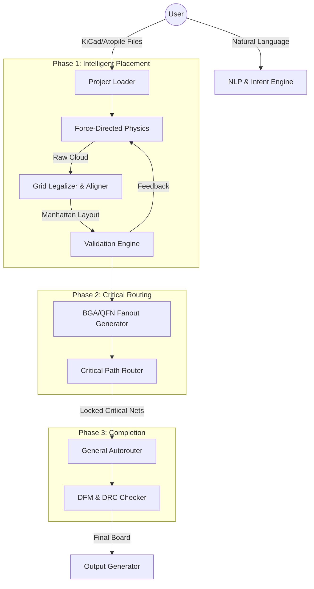

# Product Requirements Document: AtoPlace (v2.0)

**Date:** 2026-01-11
**Status:** Living Document
**Target Audience:** Development Team, Product Stakeholders

---

## Index

- 1. Product Vision
- 2. Core Value Pillars
- 3. System Architecture
- 4. Functional Requirements
- 5. Roadmap & Phasing
- 6. Technical Constraints & Standards
- Appendix A: Atopile Integration (Future Spec)
- Appendix B: MCP Server Integration (Future Spec)
- Appendix C: Freerouting Integration (Future Spec)

---

## 1. Product Vision
To provide Professional Electrical Engineers with an "AI Pair Designer" that automates the tedious 80% of PCB layout (placement optimization, non-critical routing, validation) while strictly adhering to "Manhattan" design aesthetics, DFM constraints, and Signal Integrity (SI) best practices. Unlike "Black Box" autorouters, AtoPlace produces human-readable, professional-grade layouts that an engineer would be proud to claim as their own.

---

## 2. Core Value Pillars

### 2.1. "Human-Grade" Aesthetics (The "Turing Test" of Layout)
*   **Grid Compliance:** Components must not float; they must snap to user-defined grids (e.g., 0.1mm, 0.5mm, 1mm).
*   **Alignment:** Components, especially passives (R/C/L), must form strict rows or columns.
*   **Manhattan Routing:** Traces must follow 45/90-degree routing rules. No "any-angle" spaghetti unless specifically requested (e.g., flex PCBs).

### 2.2. Physics-Driven Signal Integrity
*   **Impedance First:** Critical nets (USB, Ethernet, RF) are prioritized and routed with impedance/length matching constraints.
*   **Power Plane Integrity:** Component placement prioritizes continuous ground return paths.
*   **Hierarchy-Aware:** Placement respects the logical signal flow (Input → Processing → Output).

### 2.3. Transparent Interactivity
*   **No Lock-in:** Native KiCad files are the source of truth. The user can take over manually at any moment.
*   **Explainable Actions:** The system can explain *why* a component was placed in a specific location (e.g., "Placed C1 near U1 to minimize loop inductance").
*   **Natural Language Control:** Users can direct high-level moves ("Move the USB connector to the bottom edge") without dragging individual pads.

---

## 3. System Architecture

AtoPlace operates as an orchestration layer over existing, proven EDA tools (KiCad, Freerouting).

---

## 4. Functional Requirements

### 4.1. Placement Engine (The "Brain")
*   **REQ-P-01 (Clustering):** System MUST group components by logical module (Power, Analog, Digital, RF) using schema hierarchy or netlist topology.
*   **REQ-P-02 (Physics):** System MUST use force-directed annealing for global optimization ($O(N)$ Star Model for large nets).
*   **REQ-P-03 (Legalization - CRITICAL):** System MUST apply a post-physics "Legalization Pass" that:
    *   Snaps component centroids to the user grid.
    *   Aligns adjacent same-size components (e.g., 0402 resistors) into shared-axis rows/columns.
    *   Removes overlaps using AABB/SAT collision detection.
*   **REQ-P-04 (Flow):** System MUST attempt to place components in logical signal flow order (e.g., Connector → ESD → PHY → MCU).

### 4.2. Routing Engine (The "Nervous System")
*   **REQ-R-01 (Fanout):** System MUST generate escape patterns (dogbone, via-in-pad) for high-density components (BGA/QFN) *before* general routing.
*   **REQ-R-02 (Criticality):** System MUST support a "Priority Queue" for nets:
    *   *Tier 1:* Diff-pairs, RF, Clocks (Route first, lock).
    *   *Tier 2:* Power/Ground (Route second, huge widths/planes).
    *   *Tier 3:* General Signals (GPIO, LED).
*   **REQ-R-03 (Completion):** System uses `Freerouting` (or similar) ONLY for Tier 3 nets, ensuring Tier 1/2 are protected.

### 4.3. Validation & Physics Feedback
*   **REQ-V-01 (Proactive Forces):** Validation rules (e.g., "Decoupling caps < 2mm") MUST be projected into the physics engine as high-strength attractive forces.
*   **REQ-V-02 (Confidence):** System MUST emit a "Confidence Score" (0-100%) based on:
    *   Routability estimation (congestion maps).
    *   Signal Integrity metrics (estimated crosstalk, return path discontinuities).
    *   DFM compliance (clearances, acid traps).

### 4.4. Integration & UX
*   **REQ-I-01 (Atopile):** System MUST support `ato-lock.yaml` as a first-class citizen for persistent placement data.
*   **REQ-I-02 (CLI):** System MUST provide a CLI for CI/CD integration (`atoplace check board.kicad_pcb`).
*   **REQ-I-03 (MCP):** System MUST expose an MCP Server interface for LLM agents (Claude, etc.) to perform "Human-in-the-loop" design.

---

## 5. Roadmap & Phasing

### Phase 1: The "Solid Foundation" (Current Focus)
*   **Goal:** A tool that places components logically and legally, even if not yet routed.
*   **Key Deliverables:**
    *   Fix Physics Engine (Star model, AABB collision).
    *   Implement "Legalizer" (Grid snapping, row alignment).
    *   Fix Atopile mapping (Instance path resolution).

### Phase 2: The "Routing Assistant"
*   **Goal:** A tool that can safely route a board without ruining signal integrity.
*   **Key Deliverables:**
    *   Fanout Generator for QFN/BGA.
    *   Critical Net Classifier (detect USB, Power, etc.).
    *   Partial Routing Workflow (Route critical -> Lock -> Autoroute rest).

### Phase 3: The "Professional Agent"
*   **Goal:** An autonomous agent capable of passing a Senior Engineer's design review.
*   **Key Deliverables:**
    *   MCP Server for full conversational design.
    *   Deep Signal Integrity checks (Impedance calculator, Crosstalk estimator).
    *   Automated DFM output generation (Gerbers, BOM, Pick-and-Place).

---

## 6. Technical Constraints & Standards
*   **Language:** Python 3.10+
*   **Input Format:** KiCad 6/7/8+ (`.kicad_pcb`), Atopile (`.ato`, `.yaml`)
*   **Routing Backend:** Freerouting (Java) via IPC or file exchange.
*   **License:** MIT (Open Source Core), Potential Commercial Pro Extensions.

---

## Appendix A: Atopile Integration (Future Spec)

See [ATOPILE_INTEGRATION.md](specs/ATOPILE_INTEGRATION.md) for full details.

## Appendix B: MCP Server Integration (Future Spec)

See [MCP_SERVER.md](specs/MCP_SERVER.md) for full details.

## Appendix C: Freerouting Integration (Future Spec)

See [ROUTING_STRATEGY.md](specs/ROUTING_STRATEGY.md) for full details.