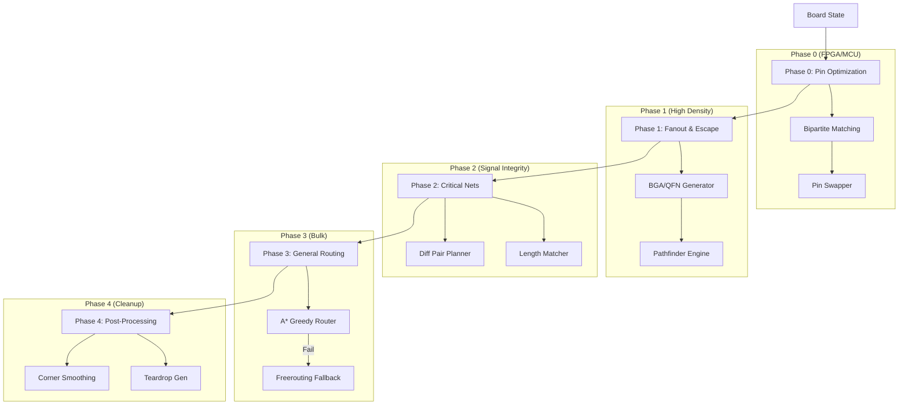

# Unified Routing Strategy & Implementation Plan

**Version:** 2.0 (Consolidated Research)
**Date:** 2026-01-13
**Scope:** From basic point-to-point connections to high-density FPGA/BGA escape and differential pairs.

---

## 1. Architectural Overview

The AtoPlace routing engine uses a **Multi-Tiered Hierarchical** approach. Instead of a single "one-size-fits-all" algorithm, we apply specialized solvers based on net constraints and topology.

### 1.1 The Routing Pipeline

---

## 2. Phase 0: Pin Optimization (The "Swapper")

**Problem:** High crossing counts in ratsnest create unroutable congestion.
**Solution:** Untangle wires at the source before routing begins.

### 2.1 Algorithms
*   **Bipartite Matching:** Model the connections between an FPGA bank and a connector/memory as a bipartite graph. Minimize total edge crossing weights.
*   **LUT-Aware Swapping:** For FPGAs, generate XDC/QSF constraint updates to reflect physical pin changes.

**Implementation Priority:** High (Pre-requisite for complex FPGA boards).

---

## 3. Phase 1: Fanout & Escape (The "Planner")

**Problem:** Standard A* cannot escape dense BGA grids without blocking outer rows.
**Solution:** Procedural pattern generation coupled with flow-based routing.

### 3.1 Fanout Generators
*   **Dogbone:** For pitch $\ge 0.65mm$. Standard via-next-to-pad.
*   **Via-in-Pad (VIP):** For pitch $< 0.5mm$. Requires micro-via tech.
*   **Onion Layer Strategy:** Assign outer rings to top layers, inner rings to deeper layers.

### 3.2 The Pathfinder Engine (Negotiation Routing)
Used specifically for the "Escape Zone" around BGAs.
*   **Logic:** Allows traces to overlap initially. Iteratively increases the cost of overlap until nets "negotiate" a legal path.
*   **Why:** A* is too greedy; Pathfinder guarantees completion by balancing congestion globally.

---

## 4. Phase 2: Critical Nets (The "Specialists")

**Problem:** Differential pairs and length-matched buses have strict geometric constraints (phase, impedance) that generic pathfinders ignore.

### 4.1 Differential Pairs (Dual-Grid A*)
*   **Concept:** Route the *centerline* of the pair, inflating obstacles by `width + gap + clearance`.
*   **Cost Function:** Heavy penalty for uncoupling (splitting around obstacles).
*   **Phase Matching:** Dynamic insertion of "bumps" at bends to keep inner/outer path lengths equal.

### 4.2 Length Matching (The "Tuner")
*   **Algorithm:** Post-route pass using **Spatial Interval Trees** to find free space alongside traces.
*   **Geometry:** Insert "Accordion" or "Trombone" meanders to add delay.

---

## 5. Phase 3: General Routing (The "Workhorse")

**Problem:** Connecting thousands of non-critical signals (GPIO, LED, control lines) quickly.
**Solution:** Fast, deterministic geometric search.

### 5.1 A* with Greedy Multiplier
*   **Current Status:** **Implemented** in `astar_router.py`.
*   **Logic:** `f(n) = g(n) + w * h(n)` where $w=2.0$. Traces optimality for 100x speedup.
*   **Collision:** Uses **Spatial Hash Index** (O(1)) for obstacle detection.

### 5.2 Freerouting Fallback
*   If the internal A* fails (completeness < 100%), export DSN to Freerouting (Java) for topological push-and-shove resolution.

---

## 6. Implementation Roadmap

### Milestone 1: Solidify Base ✅ COMPLETE
- [x] A* Router Core (Greedy Multiplier) - `astar_router.py`
- [x] Spatial Hash Indexing - `spatial_index.py`
- [x] RoutingManager to orchestrate net ordering and result merging - `manager.py`
- [x] CLI command: `atoplace route` with diff pair detection
- [x] MCP tools: `route_board`, `route_net`, `detect_diff_pairs`, `get_routing_preview`

### Milestone 2: The Routing Assistant ✅ COMPLETE
- [x] **Diff Pair Detector:** Auto-detect diff pairs from net names - `diff_pairs.py`
- [x] **Diff Pair Router:** Basic implementation (full coupled routing in progress)
- [x] **Fanout Generator:** Procedural Dogbone/VIP placement - `fanout/`
- [x] **Pin Swapper:** MCU/FPGA/Connector pin swapping with Hungarian algorithm - `pinswapper/`

### Milestone 3: High Density (Q2 2026)
- [ ] **Pathfinder Engine:** Implement negotiation-based routing for BGA escape zones.
- [ ] **Length Tuning:** Implement accordion generation (skeleton in `LengthMatcher`).
- [ ] **Teardrops:** Post-processing geometry upgrade.

## 7. Data Structures & Tech Stack

*   **Language:** Python 3.10+ (Type Hinted).
*   **Geometry:** `numpy` for vector math, Custom `SpatialHashIndex` (no R-Tree dependencies to keep it lightweight).
*   **Visualization:** SVG-based `RouteVisualizer` (already planned/in-progress).
