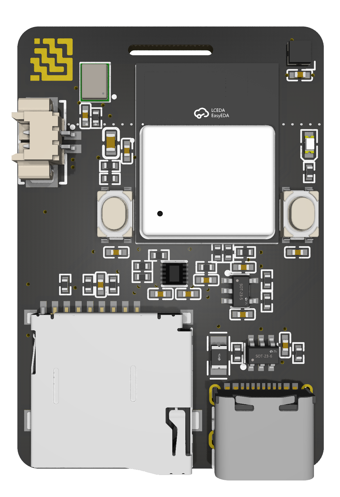
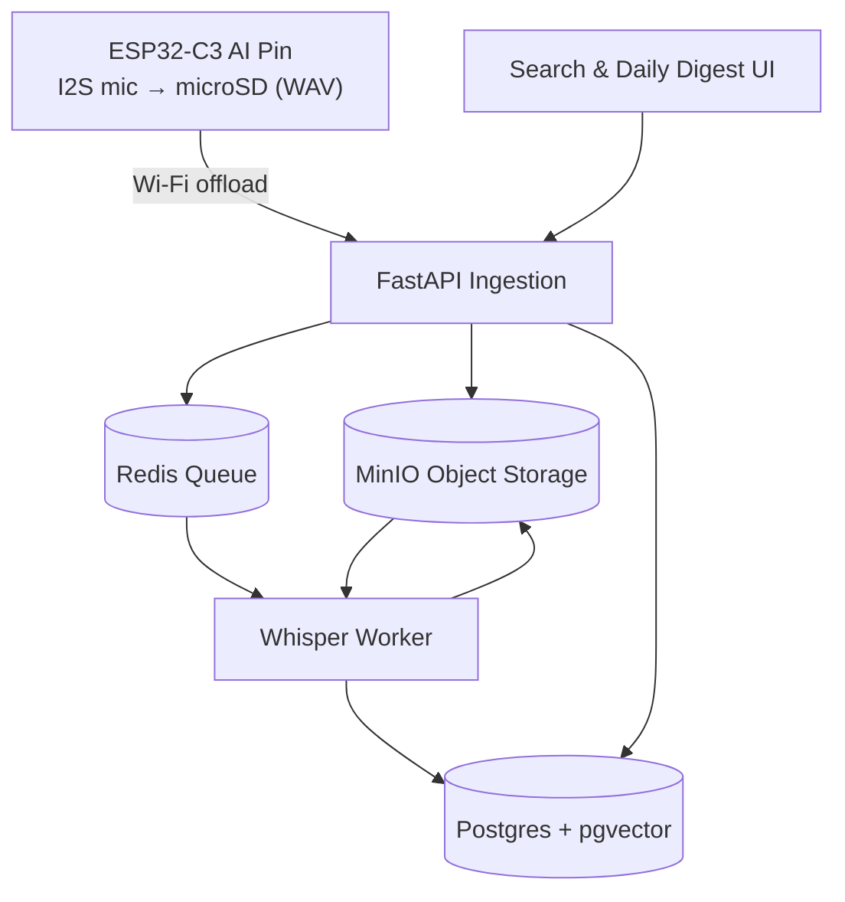
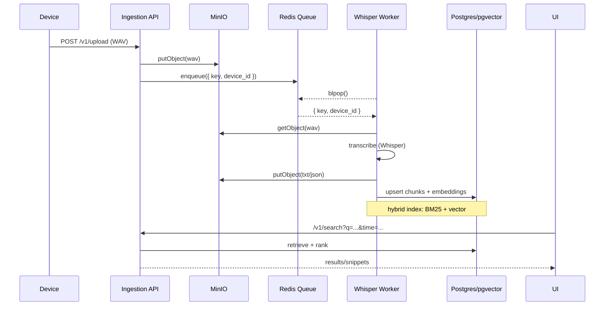

## AI Pin — Your private, wearable memory



**Stop forgetting what matters.** AI Pin is a privacy‑first wearable that captures your conversations throughout the day, then—when you’re home—offloads to your own local server to transcribe and make everything searchable. Ask, “What did I promise Alex yesterday?” or “What did I get done today?” and get instant answers from your own life.

### Why this is different

- **AI‑designed hardware**: The PCB is designed using `atopile` (a declarative electronics DSL) and lives as code in `ai-pin.ato`.
- **Local‑first by default**: All storage, transcription, embeddings and search run on your own machine—no cloud or third‑party services.
- **End‑to‑end system**: Wearable capture → local ingestion → Whisper transcription → vector search → Q&A and daily summaries.

### What it does

- **Continuous or on‑demand capture** via an I2S MEMS mic, storing audio on microSD.
- **Nightly offload** over Wi‑Fi while charging to a local server (Docker Compose).
- **Local transcription** using Whisper (GPU if available, CPU fallback).
- **Search & recall** across transcripts with semantic + keyword search.
- **Daily digest** of your day’s conversations and key moments.

### Moments you’ll stop forgetting

- “What did I promise to follow up on in today’s meeting?”
- “Who did I meet at the event—and what did we agree to do next?”
- “Which book/podcast did Sam recommend at lunch?”
- “What were the price, dates, and address the contractor mentioned?”
- “Where did we leave off on that debugging thread last week?”
- “What did the coach say about pickup changes for tomorrow?”
- “What’s the Wi‑Fi password/door code they told me?”
- “What exact phrasing did I use when I committed to that deliverable?”
- “What were the three ideas I said I’d write down later?”

---

## Architecture



### Processing flow (upload → answer)



### Hardware (designed in code)

- MCU: ESP32‑C3 Mini‑1 (`I2S`, `SPI`, `Wi‑Fi`)
- Mic: TDK InvenSense ICS‑43434 (digital I2S)
- Storage: microSD over SPI
- Power: USB‑C → BQ25185 charger/power‑path → LDO (3.3 V)
- Battery: LP402535 (configurable)

See `ai-pin.ato` for the complete, declarative hardware design.

### Firmware (Zephyr RTOS)

- I2S capture → ring buffer → WAV writer (5–10 min segments)
- FATFS on SPI microSD, crash‑safe finalize, sidecar metadata
- Wi‑Fi offload window while charging; TLS upload
- Simple UX: LED states and a single button

### Local backend (Docker Compose)

- Ingestion API (FastAPI)
- Object storage (MinIO)
- Database (Postgres + pgvector)
- Queue (Redis)
- Transcription worker (Whisper via `faster-whisper`)

---

## Agents and your private history

You can point a local agent at your private transcripts to answer questions and automate tasks—without sending data to the cloud.

- **Local‑only by default**: Retrieval happens against your local DB/object store. No outbound calls unless you enable them.
- **Hybrid retrieval**: BM25 + vector search with time filters and device/user scoping.
- **Defensive prompts**: The API returns citations and timestamps; agents are encouraged to include them in answers.

Planned Agent API (local):

- `GET /v1/search` – hybrid search over transcripts
- `POST /v1/agents/query` – higher‑level query that returns stitched context windows for LLMs
- `POST /v1/agents/sessions` – create a scoped session with time/person/topic constraints

Example (planned) search call:

```bash
curl "http://localhost:8080/v1/search?q=what+did+I+promise+Alex&from=2025-01-01&to=2025-01-31&top_k=10"
```

Privacy boundaries:

- Local network only; bind to loopback or LAN per your `.env`.
- API tokens for agent clients; optional mTLS.
- Audit log of queries; per‑user/device scoping.
- Optional redaction layer (emails, credit cards) before indexing.

---

## Quickstart

### 1) Start the local stack

Create `backend/compose/.env` with these defaults (edit as needed):

```env
API_HOST=0.0.0.0
API_PORT=8080

MINIO_ENDPOINT=minio:9000
MINIO_ACCESS_KEY=minio
MINIO_SECRET_KEY=minio12345
MINIO_SECURE=false
MINIO_BUCKET=aipin

REDIS_URL=redis://redis:6379/0
WHISPER_MODEL=small
WHISPER_COMPUTE_TYPE=auto
```

Then launch:

```bash
cd backend/compose
docker compose up -d
```

Services:

- API: `http://localhost:8080`
- MinIO console: `http://localhost:9001` (user: `minio`, pass: `minio12345`)
- Postgres: `localhost:5432`
- Redis: `localhost:6379`

Health check:

```bash
curl http://localhost:8080/healthz
```

### 2) Upload a sample WAV (simulating the device)

```bash
curl -X POST \
  -F "device_id=test-device" \
  -F "file=@/path/to/sample.wav;type=audio/wav" \
  http://localhost:8080/v1/upload
```

The worker will pick it up, transcribe, and write a `.txt` next to the `.wav` in MinIO.

---

## Developing the firmware (ESP32‑C3 + Zephyr)

See detailed instructions in `firmware/zephyr/README.md`. Quickstart:

Prereqs (one‑time):

```bash
/opt/homebrew/bin/python3 -m venv "$HOME/zephyr-venv"
source "$HOME/zephyr-venv/bin/activate"
pip install -U pip west
cd "$HOME/zephyrproject"
export ZEPHYR_SDK_INSTALL_DIR="$HOME/zephyr-sdk-0.17.2"
export ZEPHYR_TOOLCHAIN_VARIANT=zephyr
west zephyr-export
```

Build & flash:

```bash
source "$HOME/zephyr-venv/bin/activate"
cd "$HOME/zephyrproject"
west build -b esp32c3_devkitm $(pwd -P)/../projects/ai-pin/firmware/zephyr/app -p always -- \
  -DDTC_OVERLAY_FILE=boards/esp32c3_devkitm.overlay \
  -DPython3_EXECUTABLE="$HOME/zephyr-venv/bin/python" -DWEST_PYTHON="$HOME/zephyr-venv/bin/python"
west flash
```

Provision Wi‑Fi on SD card (root):

```ini
ssid=YOUR_SSID
psk=YOUR_PASSWORD
```

Troubleshooting highlights:

- Missing blobs for ESP32: `west blobs fetch hal_espressif`
- I2S DMA error: ensure overlay enables `&dma { status = "okay"; }` and `&i2s { dmas = <&dma 0>, <&dma 1>; }`, and `CONFIG_DMA=y` in `prj.conf`
- CMake can’t find west: pass venv python flags shown above

---

## Project status

- Hardware captured in `ai-pin.ato` (Atopile)
- Backend Compose stack scaffolded: API + MinIO + Postgres + Redis + Whisper worker
- Firmware stubs prepared (Zephyr app structure)

See `spec.md` and `todo.md` for detailed scope, milestones, and open questions.

---

## Roadmap (MVP highlights)

- End‑to‑end ingest → transcribe
- Daily summary generation
- OTA updates via MCUboot
- Optional SD encryption and mTLS device identity

---

## Contributing

Issues and PRs welcome. The goal is a great local‑first reference design for private, wearable memory.

---

## License

MIT
