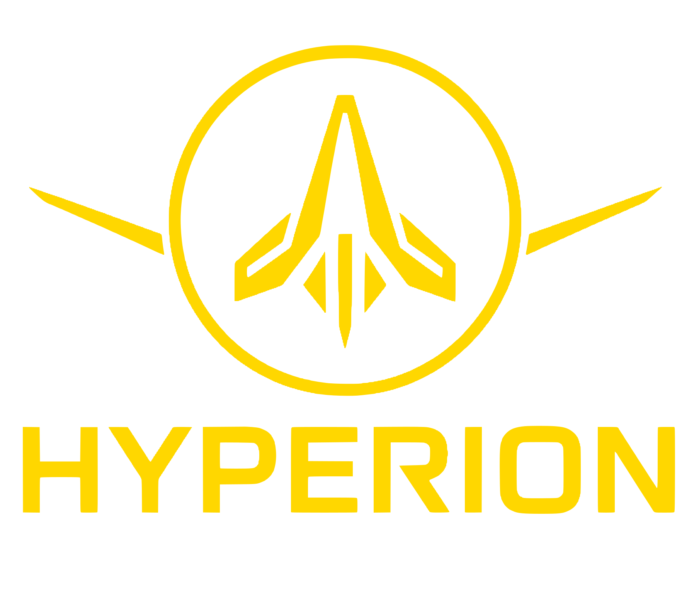
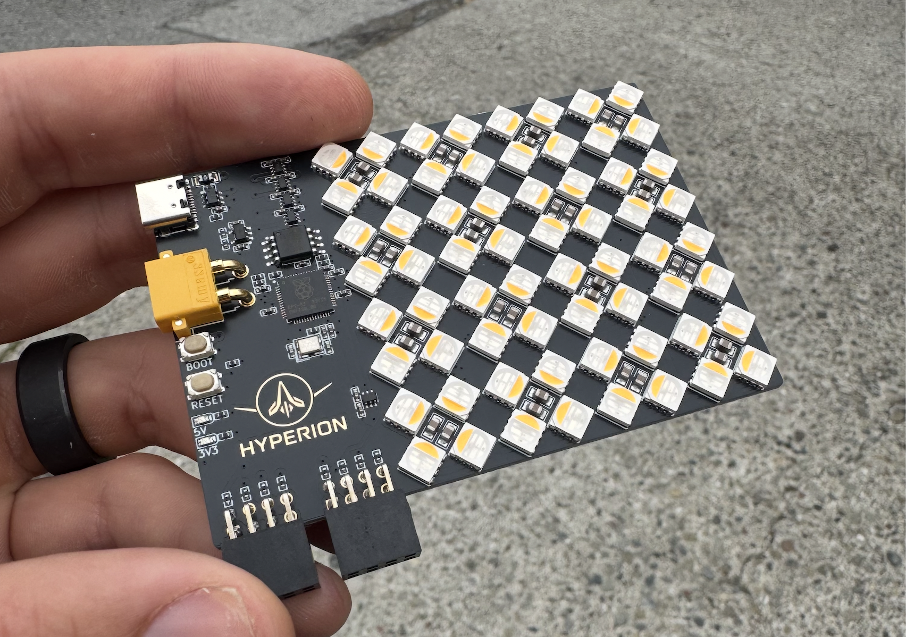
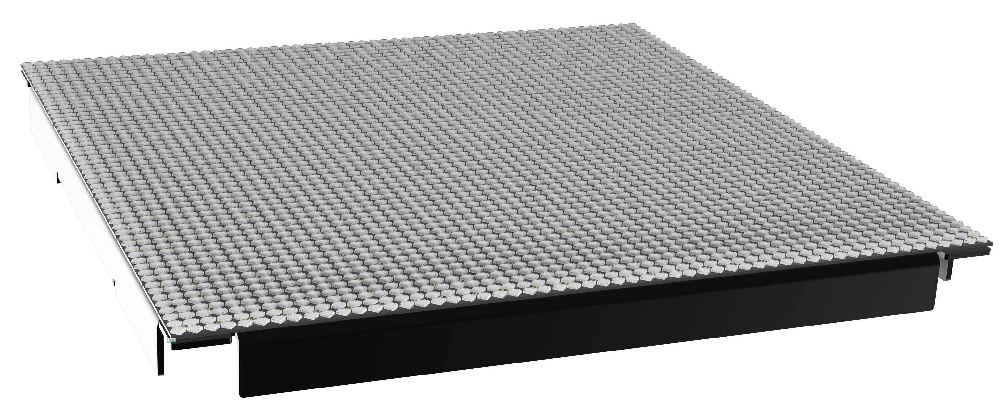

  

Insanely bright modular LED display

### *** IN DEVELOPMENT ***
Project is currently in development and may not compile with latest compiler.

### Why

Current LED matrix displays are underwhelming: low brightness, low dynamic range, and washed‑out visuals in real venues. Hyperion flips that on its head with ridiculous luminance, high refresh, and a visual language that holds up in fog, dark, and daylight spill.

### Highlights

- **Blinding brightness**: designed to punch through haze and stage lighting
- **High refresh**: > 500 Hz target for artifact‑free motion and strobes
- **Chunky pixels**: 4 LEDs per pixel, **15 mm pitch** for bold geometry
- **Modular**: building full **420 × 420 mm** panels (limited by JLC assembly)
- **Controls**: video stream input (WIP) + DMX for audio‑sync (planned)

### Status

- We’ve built an initial coupon: **60 × 60 mm**, peak measured draw ~ **42 W**
- Driver: Macroblock **MBI5043** current sink
- Power rails: LED 5–17 V, logic 5 V / 3.3 V (RP2040 control)

### Pixel geometry

- **Pitch**: 15 mm → ~66 px/m in each axis → ~4,444 px/m²
- **LEDs per pixel**: 4 (RGBW cluster) → ~17,776 LEDs/m²
- **Look**: deliberately low‑density, high‑punch “big voxel” aesthetic

### How bright is it? A back‑of‑the‑napkin estimate

- Coupon area A = 60 mm × 60 mm = **0.0036 m²**
- Peak power P ≈ **42 W**
- If LED efficacy η ≈ **60–100 lm/W** (RGBW mix, conservative):
  - Luminous exitance M ≈ P·η/A ≈ 0.94–1.17 × 10⁶ lm/m²
  - Luminance L ≈ M/π ≈ **220k–370k nits**
- Compared to MacBook Pro (XDR): typical SDR ~500 nits; HDR sustained ~1,000 nits; peak ~1,600 nits. Hyperion coupon (est.): **~140×–700× brighter** per unit area.
  - Peak power assumes ~1% duty cycle for bright strobe effects or fractional‑panel use; not continuous.

Note: 42 W on 0.0036 m² implies ~11.7 kW/m² at full blast. Scaled to a **3 × 2 m** panel: ~**70–75 kW** peak. This is a thermal and power‑distribution thought experiment, not a duty‑cycle recommendation.

### Light as an underexplored rave medium

Light isn’t just illumination; it’s a volumetric instrument. Hyperion treats photons like sound—sculpted in space, time, and intensity—to cut through haze and occupy the room, not just the wall.

- Spatial volume: beams and voxels that read in fog, from meters away
- Temporal punch: sub‑ms strobes and decay envelopes, not just fades
- Materiality: bold pixels and high luminance over fine‑pitch “screens”
- Emergence: interference, moiré, and wavefronts that breathe with the music

  

### Roadmap

- Assemble first **420 × 420 mm** panels
- Ingest **video streams** (software pipeline WIP)
- **DMX** input for lighting desk sync and audio‑reactive modes
- Thermal, PSU, and duty‑cycle constraints for safe operation
- Thermal/power R&D: explore bulk energy storage (caps/supercaps) for strobe transients and peak handling
- Distributed temperature sensing across panels (NTC grid or digital sensors) for thermal maps and throttling

  

  

### License

MIT
