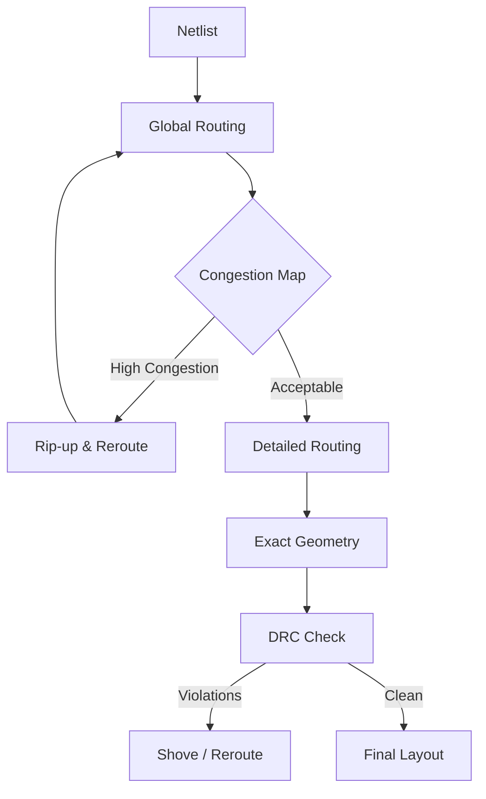

# KiCad Autorouting and Autoplacement: Expanded Research

**Expanded from Original Document | January 2026**

---

## Table of Contents

1. [Executive Summary](#1-executive-summary)
2. [Foundational Routing Algorithms](#2-foundational-routing-algorithms)
3. [Advanced Autorouting Tools](#3-advanced-autorouting-tools)
4. [Component Placement Theory](#4-component-placement-theory)
5. [AI and Machine Learning in PCB Design](#5-ai-and-machine-learning-in-pcb-design)
6. [KiCad Architecture Deep Dive](#6-kicad-architecture-deep-dive)
7. [Signal Integrity Considerations](#7-signal-integrity-considerations)
8. [Design for Manufacturing (DFM)](#8-design-for-manufacturing-dfm)
9. [Implementation Patterns](#9-implementation-patterns)
10. [Benchmarking and Evaluation](#10-benchmarking-and-evaluation)
11. [Future Directions](#11-future-directions)

---

## 1. Executive Summary

This expanded research document builds upon the original findings to provide deeper technical context on autorouting and autoplacement for KiCad. While the original document focused on tool comparisons and practical recommendations, this expansion covers the underlying algorithms, theoretical foundations, and implementation considerations essential for developing robust automated PCB layout solutions.

### Key Additions in This Expansion

- **Algorithmic foundations**: Detailed coverage of maze routing, channel routing, and global/detailed routing phases
- **Placement theory**: Quadratic placement, analytical methods, and multi-level partitioning approaches
- **Signal integrity**: Impedance-controlled routing, crosstalk mitigation, and return path analysis
- **DFM constraints**: Manufacturing-aware placement and routing considerations
- **Implementation patterns**: Code architectures for integrating placement and routing tools
- **Evaluation methodologies**: Metrics and benchmarking approaches for comparing tools

---

## 2. Foundational Routing Algorithms

Understanding the algorithmic foundations is essential for evaluating autorouting tools and developing custom solutions.

### 2.1. Maze Routing Algorithms

Maze routing forms the basis of most PCB autorouters. These algorithms treat the routing area as a grid and find paths between terminals.

#### 2.1.1. Lee Algorithm (Breadth-First Search)

The Lee algorithm, introduced in 1961, remains foundational to modern routers.

**Algorithm Overview:**
1. **Wave expansion**: Starting from the source, assign distance values to adjacent cells in a breadth-first manner
2. **Target detection**: Stop when the wave reaches the target
3. **Backtracking**: Trace from target to source following decreasing distance values

**Complexity:**
- Time: O(n²) where n is the number of grid cells
- Space: O(n²) for storing wave values

**Advantages:**
- Guarantees shortest path if one exists
- Simple to implement and understand

**Limitations:**
- High memory consumption for large boards
- Slow for high-net-count designs
- Does not consider routing cost variations

**Implementation Considerations:**
```python
def lee_route(grid, source, target):
    """Basic Lee algorithm implementation."""
    from collections import deque
    
    rows, cols = len(grid), len(grid[0])
    distance = [[-1] * cols for _ in range(rows)]
    distance[source[0]][source[1]] = 0
    
    queue = deque([source])
    directions = [(0, 1), (0, -1), (1, 0), (-1, 0)]
    
    # Wave expansion
    while queue:
        r, c = queue.popleft()
        if (r, c) == target:
            break
        for dr, dc in directions:
            nr, nc = r + dr, c + dc
            if 0 <= nr < rows and 0 <= nc < cols:
                if distance[nr][nc] == -1 and grid[nr][nc] != BLOCKED:
                    distance[nr][nc] = distance[r][c] + 1
                    queue.append((nr, nc))
    
    # Backtracking to extract path
    if distance[target[0]][target[1]] == -1:
        return None  # No path exists
    
    path = [target]
    current = target
    while current != source:
        r, c = current
        for dr, dc in directions:
            nr, nc = r + dr, c + dc
            if 0 <= nr < rows and 0 <= nc < cols:
                if distance[nr][nc] == distance[r][c] - 1:
                    path.append((nr, nc))
                    current = (nr, nc)
                    break
    
    return list(reversed(path))
```

#### 2.1.2. A* Algorithm

A* improves upon Lee routing by using heuristics to guide the search toward the target.

**Cost Function:** f(n) = g(n) + h(n)
- g(n): Actual cost from source to node n
- h(n): Heuristic estimate from n to target (typically Manhattan distance)

**Advantages over Lee:**
- Explores fewer cells in open areas
- Faster convergence to solution
- Adaptable cost functions for different optimization goals

**Heuristic Considerations for PCB Routing:**
- Manhattan distance for orthogonal routing
- Octile distance if diagonal traces are allowed
- Layer change penalties in h(n) for multi-layer designs

#### 2.1.3. Hadlock's Algorithm

Hadlock's algorithm minimizes detour distance rather than total distance.

**Detour:** The difference between path length and Manhattan distance to target.

**Key Insight:** Moves toward the target have detour 0; moves away have detour 1.

**Advantages:**
- Often faster than Lee for longer routes
- Tends to produce straighter paths

### 2.2. Channel Routing

Channel routing addresses the problem of routing nets through a rectangular channel with fixed terminal positions.

#### 2.2.1. Problem Definition

- **Channel**: Horizontal routing region with terminals on top and bottom edges
- **Vertical constraints**: Nets requiring vertical connections create constraints
- **Horizontal constraints**: Overlapping horizontal segments cannot share tracks

#### 2.2.2. Left-Edge Algorithm

The classic left-edge algorithm assigns horizontal segments to tracks based on their leftmost position.

**Algorithm:**
1. Sort segments by left edge position
2. For each segment, assign to the first available track where it doesn't overlap with existing segments
3. Create new tracks as needed

**Limitations:**
- Ignores vertical constraints
- May produce suboptimal results

#### 2.2.3. Dogleg Routing

Dogleg routing allows nets to change tracks mid-channel, reducing track count.

**Key Concept:** Break horizontal segments at intermediate columns to bypass constraints.

### 2.3. Global vs. Detailed Routing

Modern autorouters use a two-phase approach.

#### 2.3.1. Global Routing

**Purpose:** Determine the general path of each net through routing regions without specifying exact wire positions.

**Outputs:**
- Region assignments for each net
- Estimated congestion per region
- Layer assignments (in multi-layer designs)

**Algorithms:**
- Integer Linear Programming (ILP)
- Steiner tree-based methods
- Negotiation-based routing (PathFinder)

#### 2.3.2. Detailed Routing

**Purpose:** Convert global routing solutions into exact geometric wire positions.

**Tasks:**
- Precise wire placement within regions
- Via insertion for layer changes
- DRC compliance

**Algorithms:**
- Maze routing (Lee, A*)
- Channel routing
- Gridless routing for analog designs

### 2.4. Rip-Up and Reroute

When initial routing fails or produces suboptimal results, rip-up and reroute techniques improve solutions.

#### 2.4.1. Net Ordering

The order in which nets are routed significantly affects results.

**Strategies:**
- **Criticality-based**: Route timing-critical nets first
- **Shortest-first**: Route short nets to reduce congestion blocking
- **Most-constrained first**: Route nets with fewest routing options first

#### 2.4.2. Negotiation-Based Routing (PathFinder)

PathFinder, used in FPGA routing and OrthoRoute, iteratively adjusts routing costs based on congestion.

**Algorithm:**
1. Route all nets, allowing overlap
2. Calculate congestion for each routing resource
3. Increase cost of congested resources
4. Re-route congested nets
5. Repeat until no overlaps remain

**Cost Update:**
```
cost(r) = base_cost(r) + historical_cost(r) * present_congestion(r)
```

### 2.5. Automated Fanout Strategies

Fanout is the critical first step in routing high-density components (BGAs, fine-pitch QFNs) to make their pins accessible to the broader routing layers.

#### 2.5.1. Fanout Patterns
*   **Dogbone**: Standard via placement offset from the pad.
*   **Via-in-Pad**: Via placed directly in the pad (requires manufacturing capability).
*   **North/South/East/West**: Directional fanout for maximizing routing channels.

#### 2.5.2. Breakout Routing
Since autorouters often struggle with BGA escape routing, a dedicated "Fanout Pass" is recommended before the main routing phase. This pass creates short traces to vias to "escape" the component body.

### 2.6. Visualizing the Algorithms

#### 2.6.1. Global vs Detailed Routing Flow



---

## 3. Advanced Autorouting Tools

*> **2026 Market Update:** The gap between hobbyist and enterprise tools has widened. Quilter AI has secured $40M to solve "physics-based" design, while open-source tools like OrthoRoute are leveraging consumer GPUs to tackle massive net counts.*

### 3.1. Freerouting Deep Dive

### 3.1. Freerouting Deep Dive

#### 3.1.1. Architecture

Freerouting uses a push-and-shove router with the following components:

- **DSN Parser**: Reads Specctra Design format from KiCad export
- **Geometry Engine**: Handles trace and via geometries
- **Routing Engine**: Core autorouting logic with rip-up/reroute
- **SES Writer**: Outputs routed design for KiCad import

#### 3.1.2. Algorithmic Approach

Freerouting combines several techniques:

1. **Fanout routing**: Initial short connections from pads
2. **Maze routing**: Primary routing engine
3. **Push and shove**: Moves existing traces to accommodate new ones
4. **Via optimization**: Post-routing via minimization

#### 3.1.3. Configuration Parameters

Key parameters affecting routing quality:

| Parameter | Description | Impact |
|-----------|-------------|--------|
| `max_passes` | Maximum routing iterations | Higher = better completion, slower |
| `via_costs` | Penalty for via insertion | Higher = fewer vias, longer traces |
| `preferred_direction` | Layer routing direction | Reduces crosstalk, aids completion |

#### 3.1.4. Python Client Integration Pattern

```python
class FreeroutingIntegration:
    """Wrapper for Freerouting with fallback strategies."""
    
    def __init__(self, api_key=None, jar_path=None):
        self.api_key = api_key
        self.jar_path = jar_path or self._find_jar()
        self.use_cloud = api_key is not None
    
    def route(self, dsn_path, options=None):
        """Route a DSN file with automatic method selection."""
        options = options or {}
        
        # Estimate complexity
        complexity = self._estimate_complexity(dsn_path)
        
        if complexity > CLOUD_THRESHOLD and self.use_cloud:
            return self._route_cloud(dsn_path, options)
        else:
            return self._route_local(dsn_path, options)
    
    def _estimate_complexity(self, dsn_path):
        """Estimate routing complexity from DSN file."""
        with open(dsn_path) as f:
            content = f.read()
        
        # Count nets and components
        net_count = content.count('(net ')
        component_count = content.count('(component ')
        
        return net_count * component_count
    
    def _route_local(self, dsn_path, options):
        """Route using local JAR file."""
        import subprocess
        
        ses_path = dsn_path.replace('.dsn', '.ses')
        cmd = [
            'java', '-jar', self.jar_path,
            '-de', dsn_path,
            '-do', ses_path,
            '-mp', str(options.get('max_passes', 100))
        ]
        
        result = subprocess.run(cmd, capture_output=True, text=True)
        
        if result.returncode != 0:
            raise RoutingError(f"Freerouting failed: {result.stderr}")
        
        return ses_path
    
    def _route_cloud(self, dsn_path, options):
        """Route using cloud API."""
        from freerouting import FreeroutingClient
        import base64
        
        client = FreeroutingClient(self.api_key)
        
        output = client.run_routing_job(
            name=f"Route-{dsn_path}",
            dsn_file_path=dsn_path,
            poll_interval=options.get('poll_interval', 10)
        )
        
        ses_path = dsn_path.replace('.dsn', '.ses')
        with open(ses_path, 'wb') as f:
            f.write(base64.b64decode(output['data']))
        
        return ses_path

### 3.2. OrthoRoute Technical Analysis (Updated Jan 2026)

**Status:** Production-ready for KiCad 9.
**Key Achievement:** Routed a 200x160mm backplane with 8,192 nets, 17,600 pads, and 32 layers in 41 hours.
**Hardware:** Requires NVIDIA GPU. Extreme boards (32-layer) need ~33.5GB VRAM (A100 class), but standard boards (6-layer, 100x100mm) run on consumer hardware (8-12GB VRAM).

#### 3.2.1. GPU Parallelization Strategy

OrthoRoute implements a "Parallel Dijkstra" kernel using CuPy to solve shortest paths for thousands of nets simultaneously. It treats the board as a graph of billions of nodes (grid intersections).

#### 3.2.2. PathFinder Implementation

OrthoRoute uses the PathFinder algorithm (originally for FPGAs):
1.  **First Iteration:** Route every net purely for shortest path, ignoring collisions.
2.  **Subsequent Iterations:** "Rip up" nets in congested areas, increase the cost of those nodes, and reroute.
3.  **Convergence:** The system eventually stabilizes where no node is over-subscribed.

**Performance:**
*   512 net board: ~2 minutes
*   8,192 net backplane: 41 hours
*   Via Count: 44,233 (on massive backplane)

#### 3.2.3. Integration & Limitations
*   **IPC API**: Uses KiCad 9's new socket-based API (bypassing the old plugin manager due to bugs).
*   **Manhattan Only**: Currently limited to 90-degree trace bends.
*   **Cloud Option**: Can export `.ORP` files to route on rented cloud GPUs.

#### 3.2.4. DeepPCB and Emerging Agents (2026 Update)

**DeepPCB:** At CES 2026, DeepPCB showcased a pivot toward autonomous AI agents. Their "Pro" tier now features an agent that can interpret datasheet constraints directly.

**New Contenders:**
*   **letstrace**: An open-source, LLM-driven routing assistant gaining traction for stiffness/flex-PCB routing.
*   **KiForge**: Specialized AI for symbol and footprint generation from PDF datasheets, solving the "garbage-in/garbage-out" library problem.

### 3.3. Topological Routing

An emerging approach not fully covered in the original document.

#### 3.3.1. Concept

Topological routing focuses on maintaining the relative order and relationships between traces rather than exact geometric positions.

**Advantages:**
- Flexible to component movement
- Better for iterative design refinement
- Preserves designer intent

#### 3.3.2. Rubber-Band Routing

Traces are represented as rubber bands that stretch and adapt to component positions.

**Applications:**
- Interactive placement with live routing preview
- Sketch-based design interfaces
- Design space exploration

---

## 4. Component Placement Theory

### 4.1. Problem Formalization

#### 4.1.1. Objective Functions

Component placement typically optimizes one or more objectives:

1. **Total wirelength**: Sum of half-perimeter bounding boxes (HPWL) for all nets
2. **Routability**: Estimated routing congestion
3. **Timing**: Critical path delay
4. **Thermal distribution**: Heat dissipation balance
5. **Signal integrity**: Crosstalk and interference minimization

#### 4.1.2. Constraints

- **Non-overlap**: Components must not physically overlap
- **Board boundary**: All components within board outline
- **Keep-out zones**: Restricted areas for mechanical/thermal reasons
- **Grouping**: Related components placed together

### 4.2. Quadratic Placement

#### 4.2.1. Mathematical Foundation

Quadratic placement minimizes the squared wirelength:

**Objective:** 
```
minimize Σ (w_ij * ((x_i - x_j)² + (y_i - y_j)²))
```

Where:
- w_ij: Connection weight between components i and j
- x_i, y_i: Position of component i

#### 4.2.2. Solution Method

The quadratic objective leads to a linear system:

```
Qx = d_x
Qy = d_y
```

Where Q is the connectivity matrix and d contains fixed position contributions.

**Advantages:**
- Global optimization
- Fast solution via sparse linear solvers
- Good starting point for refinement

**Limitations:**
- Ignores non-overlap constraints (produces overlapping placements)
- Requires spreading/legalization phase

### 4.3. Analytical Placement Pipeline

Modern analytical placers follow a multi-stage pipeline:

#### 4.3.1. Global Placement

1. **Quadratic placement**: Initial position estimation
2. **Spreading**: Iteratively reduce overlap using density functions
3. **Coarsening/Refinement**: Multi-level approach for large designs

#### 4.3.2. Legalization

Convert continuous placement to valid non-overlapping positions:

- **Greedy**: Place components one by one, nearest legal position
- **Tetris**: Row-based legalization (for standard cells)
- **Abacus**: Optimal within-row legalization

#### 4.3.3. Detailed Placement

Local optimization of legal placement:

- **Cell swapping**: Exchange adjacent components
- **Cell sliding**: Adjust positions within rows
- **Window-based optimization**: Optimize small regions independently

### 4.4. Simulated Annealing Details

#### 4.4.1. Energy Function Design

The energy function for PCB placement should capture multiple objectives:

```python
def placement_energy(placement, netlist, board):
    """Multi-objective energy function for SA placement."""
    
    # Wirelength component (HPWL)
    wirelength = sum(
        net_hpwl(net, placement) 
        for net in netlist.nets
    )
    
    # Overlap penalty
    overlap = calculate_overlap_area(placement)
    
    # Boundary violation
    boundary = sum(
        max(0, c.x + c.width - board.width) +
        max(0, c.y + c.height - board.height) +
        max(0, -c.x) + max(0, -c.y)
        for c in placement.components
    )
    
    # Routability estimation
    congestion = estimate_routing_congestion(placement, netlist)
    
    # Weighted combination
    return (
        WEIGHT_WIRE * wirelength +
        WEIGHT_OVERLAP * overlap +
        WEIGHT_BOUNDARY * boundary +
        WEIGHT_CONGESTION * congestion
    )
```

#### 4.4.2. Move Generation

Effective move generation is critical for SA convergence:

```python
class PlacementMoves:
    """Move generators for SA placement."""
    
    def random_move(self, placement):
        """Random displacement of a component."""
        comp = random.choice(placement.components)
        
        # Adaptive displacement based on temperature
        max_disp = self.max_displacement * (self.temperature / self.initial_temp)
        
        dx = random.uniform(-max_disp, max_disp)
        dy = random.uniform(-max_disp, max_disp)
        
        return MoveDisplace(comp, dx, dy)
    
    def swap_move(self, placement):
        """Swap two components of similar size."""
        c1 = random.choice(placement.components)
        
        # Find similar-sized components
        candidates = [
            c for c in placement.components
            if c != c1 and self._similar_size(c, c1)
        ]
        
        if candidates:
            c2 = random.choice(candidates)
            return MoveSwap(c1, c2)
        
        return self.random_move(placement)
    
    def rotation_move(self, placement):
        """Rotate a component."""
        comp = random.choice(placement.components)
        angle = random.choice([90, 180, 270])
        return MoveRotate(comp, angle)
```

#### 4.4.3. Annealing Schedule

The cooling schedule significantly affects solution quality. **Note:** In practice, tuning this schedule for PCBs is notoriously difficult; improper tuning often results in "cloud-like" clusters that require significant manual legalization.

**Geometric Schedule:**
```
T(k+1) = α * T(k), where α ∈ [0.9, 0.99]
```

**Adaptive Schedule (Recommended):**
```python
def adaptive_temperature(accept_rate, target_rate=0.4):
    """Adjust cooling based on acceptance rate."""
    if accept_rate > target_rate:
        return 0.95  # Cool faster
    else:
        return 0.99  # Cool slower
```

### 4.5. Force-Directed Placement Deep Dive

#### 4.5.1. Force Model

Components experience attractive and repulsive forces:

**Attractive Force (Hooke's Law):**
```
F_attract = k_attract * d * (connected components)
```

**Repulsive Force (Coulomb's Law):**
```
F_repel = k_repel / d² * (all component pairs)
```

Where d is the distance between components.

#### 4.5.2. Implementation with Damping

```python
class ForceDirectedPlacer:
    """Force-directed placement with velocity damping."""
    
    def __init__(self, components, netlist):
        self.components = components
        self.netlist = netlist
        
        # Physics parameters
        self.k_attract = 0.1
        self.k_repel = 1000.0
        self.damping = 0.9
        self.timestep = 0.1
        
        # Initialize velocities
        for c in components:
            c.vx = 0.0
            c.vy = 0.0
    
    def iterate(self, num_iterations=100, convergence_threshold=0.01):
        """Run force-directed iterations."""
        for iteration in range(num_iterations):
            max_displacement = 0.0
            
            for comp in self.components:
                fx, fy = self._calculate_forces(comp)
                
                # Update velocity with damping
                comp.vx = self.damping * comp.vx + fx * self.timestep
                comp.vy = self.damping * comp.vy + fy * self.timestep
                
                # Update position
                dx = comp.vx * self.timestep
                dy = comp.vy * self.timestep
                
                comp.x += dx
                comp.y += dy
                
                max_displacement = max(max_displacement, abs(dx), abs(dy))
            
            # Check convergence
            if max_displacement < convergence_threshold:
                print(f"Converged at iteration {iteration}")
                break
    
    def _calculate_forces(self, comp):
        """Calculate net force on a component."""
        fx, fy = 0.0, 0.0
        
        # Attractive forces from connected components
        for net in self.netlist.nets_for(comp):
            for other in net.components:
                if other != comp:
                    dx = other.x - comp.x
                    dy = other.y - comp.y
                    d = max(1.0, (dx**2 + dy**2)**0.5)
                    
                    fx += self.k_attract * dx
                    fy += self.k_attract * dy
        
        # Repulsive forces from all components
        for other in self.components:
            if other != comp:
                dx = comp.x - other.x
                dy = comp.y - other.y
                d = max(1.0, (dx**2 + dy**2)**0.5)
                
                fx += self.k_repel * dx / (d**3)
                fy += self.k_repel * dy / (d**3)
        
        return fx, fy
```

#### 4.5.3. Multi-Level Approach

For large designs, multi-level force-directed placement improves runtime:

1. **Coarsening**: Cluster components into super-nodes
2. **Base placement**: Place coarsest level quickly
3. **Refinement**: Progressively uncoarsen and refine positions

---

## 5. AI and Machine Learning in PCB Design

### 5.1. Reinforcement Learning for Routing

#### 5.1.1. Problem Formulation

PCB routing as an RL problem:

- **State**: Current routing state (completed routes, congestion map)
- **Action**: Route next segment (direction, layer)
- **Reward**: -1 for each step, bonus for completion, penalty for DRC violations

#### 5.1.2. Challenges

- **Large action space**: Grid positions × layers × directions
- **Long horizons**: Thousands of actions per net
- **Sparse rewards**: Success only known at end

#### 5.1.3. Approaches

**DeepPCB Approach:**
- Policy network predicts next routing action
- Value network estimates remaining routing cost
- Monte Carlo Tree Search for action selection

**Limitations:**
- Requires extensive training data
- May not generalize to new board types
- Struggles with complex constraints

### 5.2. Graph Neural Networks for Placement

#### 5.2.1. Representation

PCB as a graph:
- **Nodes**: Components
- **Edges**: Nets (hyperedges for multi-pin nets)
- **Node features**: Component size, type, pin count
- **Edge features**: Net criticality, width requirements

#### 5.2.2. Architecture

```
GNN Encoder → Position Predictor → Legalization
```

**GNN Encoder:**
- Message passing between connected components
- Learns circuit topology features

**Position Predictor:**
- MLP that outputs (x, y) coordinates
- Trained to minimize wirelength

### 5.3. Generative Models for Layout

#### 5.3.1. Diffusion Models

Recent work applies diffusion models to PCB layout:

1. **Training**: Learn to denoise random layouts into valid designs
2. **Generation**: Start from noise, iteratively refine to valid layout
3. **Conditioning**: Guide generation with constraints (outline, components)

#### 5.3.2. Advantages

- Can generate multiple candidates quickly
- Learns design style from training data
- Handles complex constraint interactions

### 5.4. Hybrid AI-Classical Approaches

The most practical approaches combine AI with classical methods:

1. **AI for initialization**: Use ML to generate starting placement
2. **Classical refinement**: Apply SA or force-directed to improve
3. **AI for parameter tuning**: Learn optimal tool parameters per design type

### 5.5. Integration via MCP Servers (New 2026 Standard)

The release of KiCad 9's IPC API has enabled **Model Context Protocol (MCP)** servers to bridge Large Language Models (LLMs) with PCB design.

*   **mixelpixx/KiCAD-MCP-Server**: A suite of 52 tools allowing LLMs to inspect the board, place footprints, and even route generic traces.
*   **Circuit-Synth**: A "Code-to-Circuit" workflow where Python defines high-level intent, and AI agents (`circuit-architect`, `simulation-expert`) execute the design.

**Why this matters:** Instead of "chatting" with a PCB, these tools allow an AI to *act* on the PCB using a structured, safe API, enabling "Human-in-the-loop" automation for boring tasks (like fanout or connector placement) while leaving critical paths to the engineer.

### 5.6. Quilter AI: Project Speedrun

In December 2025, Quilter demonstrated "Project Speedrun":

*   **Goal**: Design a functional embedded Linux computer from scratch.
*   **Complexity**: 843 components, 5,141 pins.
*   **Result**: Completed in <1 week (vs typical 6-8 weeks).
*   **Outcome**: The board booted on the first try.

This milestone validated their "physics-first" approach, contrasting with LLM-based hallucination risks.

---

## 6. KiCad Architecture Deep Dive

### 6.1. File Formats

#### 6.1.1. kicad_pcb Format

S-expression format for board files:

```lisp
(kicad_pcb
  (version 20231014)
  (generator "pcbnew")
  
  (general
    (thickness 1.6)
    (drawings 0)
    (tracks 245)
    (vias 42)
  )
  
  (layers
    (0 "F.Cu" signal)
    (31 "B.Cu" signal)
    ; ... other layers
  )
  
  (footprint "Resistor_SMD:R_0402_1005Metric"
    (at 125.5 80.0)
    (property "Reference" "R1")
    ; ... pads, shapes
  )
  
  (segment
    (start 125.5 80.0)
    (end 130.0 80.0)
    (width 0.25)
    (layer "F.Cu")
    (net 1)
  )
  
  (via
    (at 130.0 80.0)
    (size 0.8)
    (drill 0.4)
    (layers "F.Cu" "B.Cu")
    (net 1)
  )
)
```

#### 6.1.2. DSN/SES Format (Specctra)

Used for Freerouting integration:

**DSN (Design):**
```lisp
(pcb "board.dsn"
  (structure
    (layer F.Cu (type signal))
    (layer B.Cu (type signal))
    (boundary (rect pcb 0 0 100 80))
  )
  (placement
    (component "R_0402"
      (place R1 125.5 80.0 front 0)
    )
  )
  (network
    (net "VCC"
      (pins R1-1 U1-3))
  )
)
```

**SES (Session - Routed Output):**
```lisp
(session "board.ses"
  (routes
    (network_out
      (net "VCC"
        (wire (path F.Cu 0.25 125.5 80.0 130.0 80.0))
        (via via_0 130.0 80.0)
        (wire (path B.Cu 0.25 130.0 80.0 140.0 85.0))
      )
    )
  )
)
```

### 6.2. IPC API Architecture (KiCad 9+)

**Released:** Feb 20, 2025
**Communication:** Protocol Buffers over NNG (Unix domain sockets / Named pipes)

This API replaces the unstable SWIG Python bindings. It allows external applications (like OrthoRoute or Python scripts) to control a *running* KiCad instance reliably.

#### 6.2.1. Protocol Buffers Schema

The IPC API uses protobuf for message definitions:

```protobuf
message Board {
    repeated Footprint footprints = 1;
    repeated Track tracks = 2;
    repeated Via vias = 3;
    repeated Net nets = 4;
    BoardSettings settings = 5;
}

message Footprint {
    string uuid = 1;
    string reference = 2;
    Point position = 3;
    double rotation = 4;
    Layer layer = 5;
    repeated Pad pads = 6;
}

message Point {
    double x = 1;
    double y = 2;
}
```

#### 6.2.2. Communication Flow

```
Python Script ↔ IPC Socket ↔ KiCad Process
                   ↓
            Protocol Buffers
```

#### 6.2.3. Migration Example

*> **Warning:** The example below uses the `kicad-python` library structure (available on PyPI), which is the community-standard wrapper for the new IPC API. Native Protobuf usage is also possible but more verbose.*

```python
# KiCad 8 (SWIG - deprecated)
import pcbnew
board = pcbnew.LoadBoard("board.kicad_pcb")

# KiCad 9+ (via kicad-python wrapper)
from kicad_python import KiCadClient

client = KiCadClient() # Connects to running KiCad instance via NNG
board = client.active_board()

for fp in board.footprints:
    # Interaction is via IPC messages, not direct memory access
    fp.position.x += 10.0
    client.update(fp) 
```

### 6.3. Plugin Development

#### 6.3.1. Plugin Types

| Type | Purpose | Registration |
|------|---------|--------------|
| Action Plugin | Toolbar/menu actions | `ActionPlugin` class |
| Footprint Wizard | Generate footprints | `FootprintWizard` class |
| File Import/Export | Custom file formats | File handlers |

#### 6.3.2. Action Plugin Template

```python
import pcbnew

class AutoPlacePlugin(pcbnew.ActionPlugin):
    def defaults(self):
        self.name = "Auto Place"
        self.category = "Layout"
        self.description = "Automatically place components"
        self.show_toolbar_button = True
        self.icon_file_name = "autoplace.png"
    
    def Run(self):
        board = pcbnew.GetBoard()
        
        # Implement placement logic
        placer = SmartPlacer(board)
        placer.place_all()
        
        # Refresh display
        pcbnew.Refresh()

AutoPlacePlugin().register()
```

---

## 7. Signal Integrity Considerations

### 7.1. Impedance-Controlled Routing

#### 7.1.1. Microstrip vs Stripline

**Microstrip** (outer layer):
```
Z0 ≈ (87 / √(εr + 1.41)) * ln(5.98h / (0.8w + t))
```

**Stripline** (inner layer):
```
Z0 ≈ (60 / √εr) * ln(4h / (0.67π(0.8w + t)))
```

Where:
- εr: Relative permittivity of substrate
- h: Height above reference plane
- w: Trace width
- t: Trace thickness

#### 7.1.2. Routing Implications

Autorouters should support:
- **Net classes**: Different impedance requirements
- **Width rules**: Per-layer trace widths
- **Length matching**: For differential pairs

### 7.2. Crosstalk Mitigation

#### 7.2.1. 3W Rule

Maintain 3× trace width spacing between traces for minimal crosstalk:
```
Spacing ≥ 3 × Width
```

#### 7.2.2. Guard Traces

Insert grounded guard traces between sensitive signals:
```
Signal A | Guard (GND) | Signal B
```

### 7.3. Return Path Analysis

*> **Reality Check:** Fully automating return path analysis (ensuring continuous reference planes and placing stitching vias) is an unsolved problem in most commercial autorouters. The strategies below are best applied as validation rules or semi-automated scripts rather than fully autonomous routing constraints.*

#### 7.3.1. Current Return Paths

High-frequency signals return via the path of least impedance (directly under the trace).

**Routing Implications:**
- Avoid layer changes that cross split planes
- Maintain continuous reference planes
- Add stitching vias near signal vias

### 7.4. Integration with Autorouters

```python
class SignalIntegrityAwareRouter:
    """Router that considers SI requirements."""
    
    def __init__(self, board, si_rules):
        self.board = board
        self.si_rules = si_rules
    
    def route_net(self, net):
        """Route with SI considerations."""
        net_class = self.si_rules.get_class(net)
        
        # Get routing parameters
        width = net_class.trace_width
        clearance = net_class.clearance
        impedance = net_class.target_impedance
        
        # Calculate layer-specific widths for impedance
        layer_widths = {}
        for layer in self.board.layers:
            layer_widths[layer] = self._calculate_width_for_impedance(
                impedance, layer
            )
        
        # Route with constraints
        route = self._route_with_constraints(
            net,
            widths=layer_widths,
            clearance=clearance,
            avoid_splits=net_class.avoid_plane_splits
        )
        
        return route
```

---

## 8. Design for Manufacturing (DFM)

### 8.1. Manufacturing Constraints

#### 8.1.1. Minimum Features

| Feature | Typical Minimum |
|---------|-----------------|
| Trace width | 3-6 mil (0.076-0.15mm) |
| Trace spacing | 3-6 mil |
| Via drill | 8-12 mil (0.2-0.3mm) |
| Via annular ring | 4-6 mil |
| Solder mask opening | 3-4 mil larger than pad |

#### 8.1.2. Aspect Ratio

Via aspect ratio = Board thickness / Drill diameter

Typical limit: 10:1 for standard processes

### 8.2. Placement DFM

#### 8.2.1. Component Spacing

Minimum spacing considerations:
- **Pick-and-place accuracy**: ±0.1mm typical
- **Reflow clearance**: Components should not shadow each other
- **Inspection access**: AOI requires clear view of joints

#### 8.2.2. Fiducial Placement

- At least 3 fiducials per board
- Two global (board corners), one local per dense area
- Clear area around fiducials (no copper, no silkscreen)

### 8.3. Routing DFM

#### 8.3.1. Acid Traps

Avoid acute angles (<90°) that trap etchant:

```
✗ Bad: Acute angle trace junction
✓ Good: 90° or larger angles
```

#### 8.3.2. Teardrop Connections

Add teardrops where traces meet pads/vias:
- Prevents weak neck at junction
- Improves manufacturing yield

### 8.4. DFM Integration

```python
class DFMAwarePlacer:
    """Placement with DFM constraints."""
    
    def __init__(self, board, dfm_rules):
        self.board = board
        self.dfm_rules = dfm_rules
    
    def validate_placement(self, placement):
        """Check DFM violations."""
        violations = []
        
        # Check component spacing
        for i, c1 in enumerate(placement.components):
            for c2 in placement.components[i+1:]:
                spacing = self._calculate_spacing(c1, c2)
                min_spacing = self.dfm_rules.min_component_spacing(c1, c2)
                
                if spacing < min_spacing:
                    violations.append(DFMViolation(
                        type='spacing',
                        components=[c1, c2],
                        actual=spacing,
                        required=min_spacing
                    ))
        
        # Check keep-out zones
        for comp in placement.components:
            for keepout in self.board.keepouts:
                if self._overlaps(comp, keepout):
                    violations.append(DFMViolation(
                        type='keepout',
                        components=[comp],
                        zone=keepout
                    ))
        
        return violations
```

---

## 9. Implementation Patterns

### 9.1. Pipeline Architecture

A robust autoplace/autoroute pipeline:

```
┌─────────────┐     ┌─────────────┐     ┌─────────────┐
│   Import    │────▶│  Placement  │────▶│   Routing   │
│   Board     │     │   Phase     │     │   Phase     │
└─────────────┘     └─────────────┘     └─────────────┘
                           │                   │
                           ▼                   ▼
                    ┌─────────────┐     ┌─────────────┐
                    │  Validate   │     │  Validate   │
                    │  Placement  │     │   Routing   │
                    └─────────────┘     └─────────────┘
                           │                   │
                           ▼                   ▼
                    ┌─────────────────────────────────┐
                    │        Export Board             │
                    └─────────────────────────────────┘
```

### 9.2. Abstraction Layer

Support multiple KiCad versions:

```python
from abc import ABC, abstractmethod

class BoardInterface(ABC):
    """Abstract interface for board manipulation."""
    
    @abstractmethod
    def load(self, path: str) -> 'Board':
        pass
    
    @abstractmethod
    def save(self, board: 'Board', path: str):
        pass
    
    @abstractmethod
    def get_footprints(self, board: 'Board') -> list:
        pass
    
    @abstractmethod
    def move_footprint(self, board: 'Board', fp, x: float, y: float):
        pass


class SwigBoardInterface(BoardInterface):
    """KiCad 8 SWIG implementation."""
    
    def load(self, path):
        import pcbnew
        return pcbnew.LoadBoard(path)
    
    def save(self, board, path):
        board.Save(path)
    
    def get_footprints(self, board):
        return list(board.GetFootprints())
    
    def move_footprint(self, board, fp, x, y):
        import pcbnew
        fp.SetPosition(pcbnew.wxPointMM(x, y))


class IpcBoardInterface(BoardInterface):
    """KiCad 9+ IPC API implementation."""
    
    def __init__(self):
        from kipy import KiCad
        self.kicad = KiCad()
    
    def load(self, path):
        return self.kicad.pcb.load(path)
    
    def save(self, board, path):
        board.save(path)
    
    def get_footprints(self, board):
        return list(board.footprints)
    
    def move_footprint(self, board, fp, x, y):
        fp.position.x = x
        fp.position.y = y


def get_board_interface() -> BoardInterface:
    """Factory for board interface based on KiCad version."""
    try:
        import pcbnew
        version = pcbnew.GetBuildVersion()
        major = int(version.split('.')[0])
        
        if major >= 9:
            return IpcBoardInterface()
        else:
            return SwigBoardInterface()
    except ImportError:
        return IpcBoardInterface()
```

### 9.3. Module-Aware Processing

Handle different circuit modules differently:

```python
class ModuleProcessor:
    """Process circuit modules with appropriate strategies."""
    
    STRATEGIES = {
        'power': PowerModuleStrategy,
        'rf': RFModuleStrategy,
        'digital': DigitalModuleStrategy,
        'analog': AnalogModuleStrategy,
        'io': IOModuleStrategy,
    }
    
    def __init__(self, board, netlist):
        self.board = board
        self.netlist = netlist
        self.modules = self._identify_modules()
    
    def _identify_modules(self):
        """Identify circuit modules from netlist analysis."""
        modules = []
        
        # Identify power module
        power_nets = {'VCC', 'VDD', 'GND', 'VSS', '3V3', '5V', '12V'}
        power_components = set()
        for net in self.netlist.nets:
            if net.name in power_nets:
                power_components.update(net.components)
        
        if power_components:
            modules.append(Module('power', power_components))
        
        # Identify RF components (by reference prefix or footprint)
        rf_prefixes = {'ANT', 'FL', 'BAL'}
        rf_footprint_patterns = ['Inductor_SMD', 'Antenna']
        rf_components = set()
        for fp in self.board.footprints:
            if any(fp.reference.startswith(p) for p in rf_prefixes):
                rf_components.add(fp)
            elif any(pat in fp.footprint_name for pat in rf_footprint_patterns):
                rf_components.add(fp)
        
        if rf_components:
            modules.append(Module('rf', rf_components))
        
        # Continue for other module types...
        
        return modules
    
    def process_all(self):
        """Process all modules with appropriate strategies."""
        for module in self.modules:
            strategy_class = self.STRATEGIES.get(
                module.type,
                DefaultModuleStrategy
            )
            strategy = strategy_class(self.board, module)
            strategy.place()
            strategy.route()
```

---

## 10. Benchmarking and Evaluation

### 10.1. Placement Metrics

| Metric | Description | Calculation |
|--------|-------------|-------------|
| HPWL | Half-perimeter wirelength | Σ(net_width + net_height) |
| Overlap | Total overlap area | Intersection of bounding boxes |
| Density | Component area / board area | Utilization percentage |
| Routability | Estimated routing difficulty | Congestion analysis |

### 10.2. Routing Metrics

| Metric | Description | Target |
|--------|-------------|--------|
| Completion | % nets successfully routed | 100% |
| Via count | Total vias inserted | Minimize |
| Total wirelength | Sum of all trace lengths | Minimize |
| Max congestion | Highest routing density area | Below threshold |
| DRC violations | Design rule errors | 0 |

### 10.3. Benchmark Suite

```python
class PlacementBenchmark:
    """Benchmark suite for placement algorithms."""
    
    def __init__(self, test_cases):
        self.test_cases = test_cases
        self.results = []
    
    def run(self, placer, name):
        """Run benchmark on a placer."""
        for case in self.test_cases:
            board = load_board(case.path)
            
            start_time = time.time()
            placement = placer.place(board)
            runtime = time.time() - start_time
            
            # Calculate metrics
            hpwl = calculate_hpwl(placement, board.netlist)
            overlap = calculate_overlap(placement)
            density = calculate_density(placement, board.outline)
            
            self.results.append(BenchmarkResult(
                placer=name,
                case=case.name,
                runtime=runtime,
                hpwl=hpwl,
                overlap=overlap,
                density=density
            ))
    
    def report(self):
        """Generate benchmark report."""
        df = pd.DataFrame([r.__dict__ for r in self.results])
        
        # Aggregate by placer
        summary = df.groupby('placer').agg({
            'runtime': 'mean',
            'hpwl': 'mean',
            'overlap': 'sum',
        })
        
        return summary
```

### 10.4. Comparison Framework

```python
def compare_routers(board_path, routers):
    """Compare multiple routers on same board."""
    
    results = {}
    board = load_board(board_path)
    
    for name, router in routers.items():
        # Export to router format
        router_input = router.export(board)
        
        # Run routing
        start = time.time()
        routed = router.route(router_input)
        runtime = time.time() - start
        
        # Import results
        routed_board = router.import_result(routed, board)
        
        # Analyze
        results[name] = {
            'runtime': runtime,
            'completion': calculate_completion(routed_board),
            'vias': count_vias(routed_board),
            'wirelength': total_wirelength(routed_board),
            'drc_errors': run_drc(routed_board),
        }
    
    return results
```

---

## 11. Future Directions

### 11.1. Emerging Technologies

#### 11.1.1. Quantum Computing for Placement

Quantum annealing shows promise for combinatorial optimization problems like placement. D-Wave systems have demonstrated PCB placement optimization with potential speedups.

#### 11.1.2. Neuromorphic Routing

Brain-inspired algorithms may handle the parallel nature of routing better than traditional approaches.

#### 11.1.3. Digital Twin Integration

Real-time simulation during placement/routing for immediate SI/PI feedback.

### 11.2. Industry Trends (2026 Snapshot)

-   **Physics-First AI**: Quilter AI ($40M Series B) uses reinforcement learning on physics simulations (EM/Thermal) rather than just "image" training.
-   **GPU Commoditization**: Tools like OrthoRoute show that consumer GPUs can solve routing problems that previously required FPGA farms.
-   **Privacy & Cloud**: A sharp divide exists. Hobbyists embrace Flux.ai/DeepPCB, while professionals demand on-premise (Quilter GovCloud) or local-only tools (OrthoRoute) due to IP concerns.

### 11.3. Open Research Questions

1. How to effectively combine AI suggestions with designer intent?
2. Can we achieve human-level routing quality without human-level compute time?
3. How to handle the increasing complexity of mixed-signal designs?
4. What level of automation is appropriate for safety-critical designs?

---

## Appendix A: Quick Reference

### A.1. Algorithm Selection Guide

| Scenario | Placement | Routing |
|----------|-----------|---------|
| Small board (<50 components) | Force-directed | Freerouting local |
| Medium board (50-200) | SA + Force refinement | Freerouting cloud |
| Large board (>200) | Multi-level analytical | OrthoRoute (GPU) |
| RF-critical | Module-aware manual | Semi-auto with constraints |
| High-speed digital | Analytical with timing | Topological + detailed |

### A.2. Tool Comparison Matrix

| Tool | Placement | Routing | KiCad Support | Offline | AI |
|------|-----------|---------|---------------|---------|-----|
| Freerouting | No | Yes | Excellent | Yes | No |
| OrthoRoute | No | Yes | KiCad 9+ | Yes | No |
| DeepPCB | Yes | Yes | Export | No | Yes |
| Autocuro | Yes | Yes | Native | Yes | Yes |
| Quilter | Yes | Yes | Export | No | Yes |
| Flux AI | Yes | Yes | Export | No | Yes |

### A.3. Common Pitfalls

1. **Routing before placement optimization**: Always finalize placement first
2. **Ignoring thermal considerations**: Heat-generating components need spacing
3. **Over-relying on autorouters for analog**: Manual routing often better
4. **Forgetting DFM checks**: Validate before sending to fab
5. **Not verifying SI requirements**: Check impedance post-routing

---

## References

1. Quinn, N.R. and Breuer, M.A. "A forced directed component placement procedure for printed circuit boards." IEEE Transactions on Circuits and Systems, 1979.

2. Cohoon, J.P. and Paris, W.D. "Genetic placement." IEEE International Conference on Computer-Aided Design, 1986.

3. Lee, C.Y. "An algorithm for path connections and its applications." IRE Transactions on Electronic Computers, 1961.

4. McMurchie, L. and Ebeling, C. "PathFinder: A negotiation-based performance-driven router for FPGAs." ACM/SIGDA International Symposium on FPGAs, 1995.

5. Mirhoseini, A. et al. "A graph placement methodology for fast chip design." Nature, 2021.

6. KiCad Documentation. "IPC API Reference." https://docs.kicad.org/

7. Freerouting Project. "Freerouting Documentation." https://freerouting.org/

---

*Document expanded from original research. Last updated: January 2026.*
